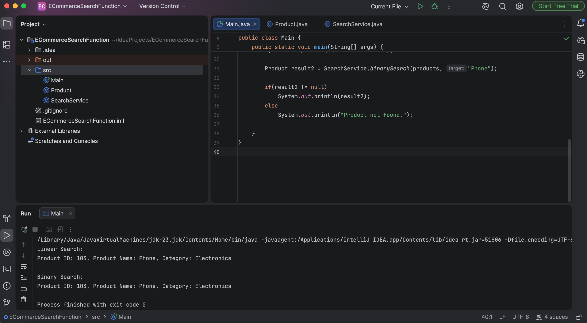

# Exercise 2 - E-commerce Platform Search Function

## Objective
Implement Linear Search and Binary Search algorithms for searching products in an e-commerce platform.

## Files
- Product.java
- SearchService.java
- Main.java

## Algorithms Used

### Linear Search
- Best Case: O(1)
- Average Case: O(n)
- Worst Case: O(n)

### Binary Search
- Best Case: O(1)
- Average Case: O(log n)
- Worst Case: O(log n)

## Conclusion
Binary Search performs faster for large sorted datasets, while Linear Search works on unsorted data but requires checking elements one by one.

## Program Output

