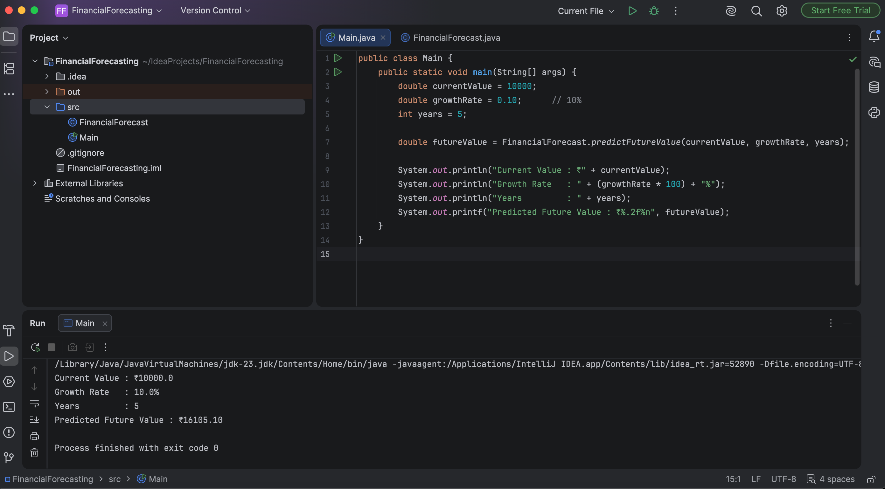

# Exercise 7 - Financial Forecasting

## Objective
Implement a recursive algorithm to predict future financial values based on a fixed annual growth rate.

## Scenario
A financial forecasting tool estimates the future value of an investment using recursion.

## Files
- FinancialForecast.java
- Main.java

## Concepts Used
- Recursion
- Base Case
- Recursive Calls
- Time Complexity Analysis

## Time Complexity
- **Time Complexity:** O(n)
- **Space Complexity:** O(n)

## Program Output

## Conclusion
The recursive approach correctly predicts future financial values by applying the annual growth rate repeatedly. For larger inputs, an iterative approach is generally more memory-efficient because it avoids the recursion call stack.
