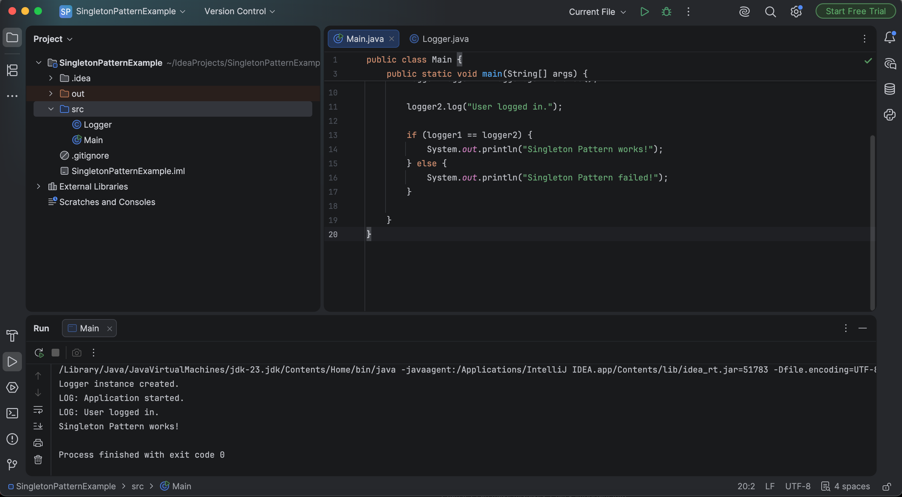

# Exercise 1 - Implementing the Singleton Pattern

## Objective
Implement the Singleton Design Pattern in Java to ensure only one instance of the `Logger` class exists throughout the application lifecycle.

## Project Structure
```
Exercise-1-Singleton-Pattern
│
├── Logger.java
├── Main.java
├── README.md
└── images
    └── singleton-output.png
```

## Files
- **Logger.java** – Implements the Singleton Pattern.
- **Main.java** – Tests the Singleton implementation.

## Expected Output
```
Logger instance created.
LOG: Application started.
LOG: User logged in.
Singleton Pattern works!
```

## Program Output


## Concepts Used
- Singleton Design Pattern
- Private Constructor
- Static Instance
- Static Factory Method
- Object Reusability
