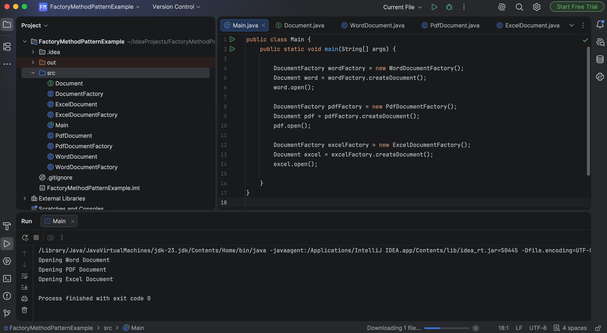

# Exercise 2 - Implementing the Factory Method Pattern

## Objective
Implement the Factory Method Design Pattern to create different types of documents.

## Scenario
A document management system should create different document types (Word, PDF, Excel) using the Factory Method Pattern.

## Files
- Document.java
- WordDocument.java
- PdfDocument.java
- ExcelDocument.java
- DocumentFactory.java
- WordDocumentFactory.java
- PdfDocumentFactory.java
- ExcelDocumentFactory.java
- Main.java

## Expected Output
```
Opening Word Document
Opening PDF Document
Opening Excel Document
```

## Program Output


## Concepts Used
- Factory Method Pattern
- Interfaces
- Abstract Classes
- Inheritance
- Polymorphism
