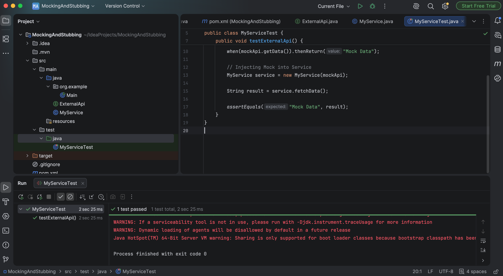

# Exercise 1 - Mocking and Stubbing

## Objective
The objective of this exercise is to understand how Mockito can be used to create mock objects and stub method responses for unit testing without depending on external services.

---

## Technologies Used
- Java
- Maven
- JUnit 5
- Mockito
- IntelliJ IDEA

---

## Project Structure
```text
Exercise-1-Mocking-and-Stubbing
│
├── pom.xml
├── ExternalApi.java
├── MyService.java
├── MyServiceTest.java
├── README.md
└── images
```

---

## Files Description
| File | Description |
|------|-------------|
| pom.xml | Maven configuration with JUnit 5 and Mockito dependencies |
| ExternalApi.java | Interface representing an external API |
| MyService.java | Service class that depends on the ExternalApi |
| MyServiceTest.java | Unit test using Mockito for mocking and stubbing |

---

### Test Result


---

## Conclusion
This exercise demonstrates how Mockito simplifies unit testing by replacing external dependencies with mock objects. Stubbing predictable responses allows service classes to be tested in isolation, resulting in reliable and maintainable unit tests.
