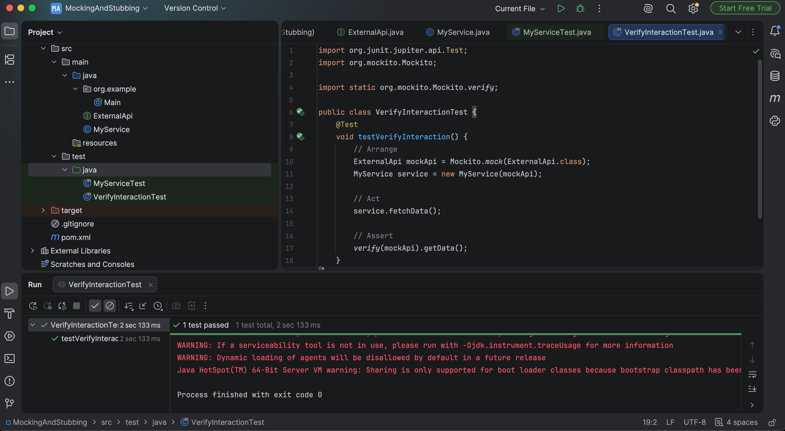

# Exercise 2: Verifying Interactions

## Objective
Verify that a method is invoked with Mockito's `verify()` functionality.

---

## Technologies Used
- Java 17+
- Maven
- JUnit 5
- Mockito
- IntelliJ IDEA

---

## Project Structure
```text
MockingAndStubbing
│
├── pom.xml
├── README.md
├── src
│   ├── main
│   │      ExternalApi.java
│   │      MyService.java
│   │
│   └── test
│         VerifyInteractionTest.java
│
└── screenshots
```

---

## Steps Performed
1. Created a mock of `ExternalApi`.
2. Injected the mock into `MyService`.
3. Invoked `fetchData()`.
4. Verified that `getData()` was called exactly once using Mockito.

---

## Output
### Test Result


---

## Result
Successfully verified interactions using Mockito's `verify()` method.
