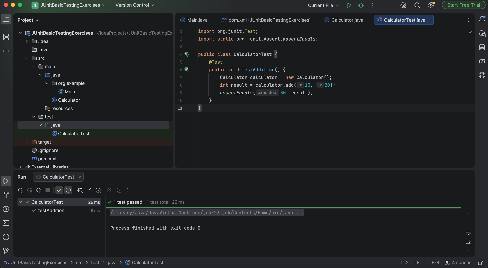

# Exercise 1 - Setting Up JUnit

## Objective
Set up JUnit in a Java Maven project and create a simple unit test to verify the functionality of a Java method.

---

## Technologies Used
- Java
- Maven
- JUnit 4.13.2
- IntelliJ IDEA

---

## Project Structure
```text
Exercise-1-Setting-Up-JUnit
│
├── pom.xml
├── Calculator.java
├── CalculatorTest.java
├── README.md
└── images
```

---

## Files
- `pom.xml` – Maven configuration with JUnit dependency
- `Calculator.java` – Simple class containing an addition method
- `CalculatorTest.java` – Unit test for the addition method

---

## Test Case
| Method | Expected Result |
|---------|-----------------|
| add(10,20) | 30 |

---

## Screenshots

### Test Execution


---

## Conclusion
This exercise demonstrates how to configure a Java project for unit testing using Maven and JUnit. It verifies a simple addition method and provides a foundation for test-driven development (TDD).
