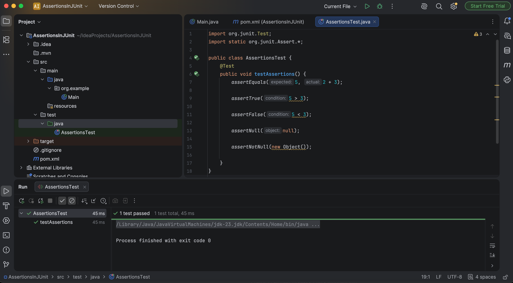

# Exercise 3 - Assertions in JUnit

## Objective
The objective of this exercise is to understand and use different JUnit assertion methods to validate expected outcomes in unit tests.

---

## Technologies Used
- Java
- Maven
- JUnit 4.13.2
- IntelliJ IDEA

---

## Project Structure
```text
Exercise-3-Assertions-in-JUnit
│
├── pom.xml
├── AssertionsTest.java
├── README.md
└── images
```

---

## Assertion Methods Used
- assertEquals()
- assertTrue()
- assertFalse()
- assertNull()
- assertNotNull()

---

### Test Execution Result


---

## Conclusion
This exercise demonstrates how JUnit assertions can be used to verify different conditions in Java programs. Assertions help ensure that code behaves as expected and form the foundation of effective unit testing.
