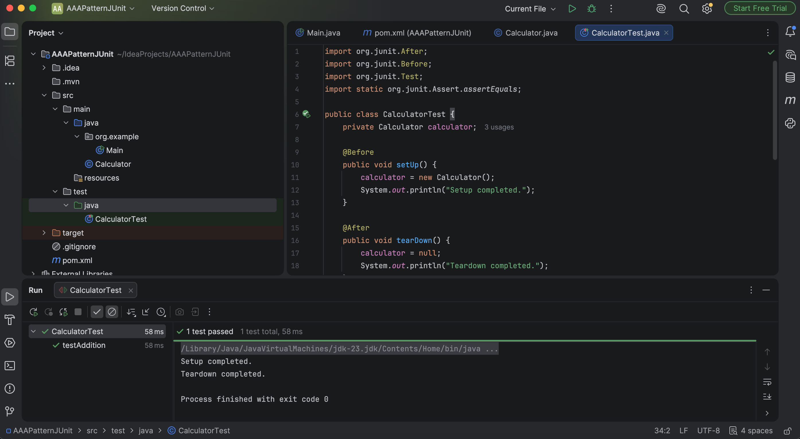

# Exercise 4 - Arrange-Act-Assert (AAA) Pattern, Test Fixtures, Setup and Teardown Methods in JUnit

## Objective
The objective of this exercise is to understand the Arrange-Act-Assert (AAA) testing pattern and learn how to use JUnit's `@Before` and `@After` annotations to perform setup and teardown operations for unit tests.

---

## Technologies Used
- Java
- Maven
- JUnit 4.13.2
- IntelliJ IDEA

---

## Project Structure
```text
Exercise-4-AAA-Pattern
│
├── pom.xml
├── Calculator.java
├── CalculatorTest.java
├── README.md
└── images
```

---

## Files Description

| File | Description |
|------|-------------|
| pom.xml | Maven configuration with JUnit dependency |
| Calculator.java | Contains the `add()` method |
| CalculatorTest.java | Demonstrates AAA pattern with setup and teardown |

---

## AAA Pattern

### Arrange
Prepare the objects and input values.

### Act
Call the method under test.

### Assert
Verify the expected output using JUnit assertions.

---

## Test Fixtures
- `@Before` initializes the Calculator object before each test.
- `@After` cleans up resources after each test.

---

### Test Result


---

## Conclusion
This exercise demonstrates how to organize unit tests using the Arrange-Act-Assert (AAA) pattern and how to manage test initialization and cleanup using JUnit test fixtures. These practices improve test readability, maintainability, and reliability.
