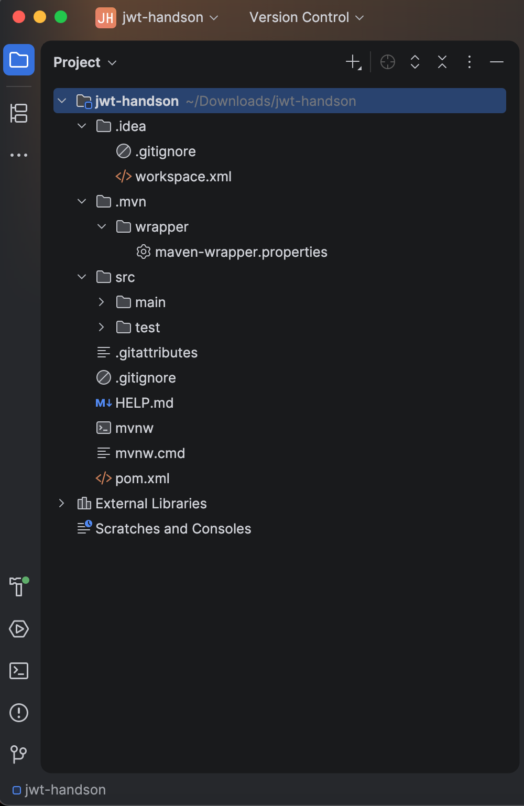
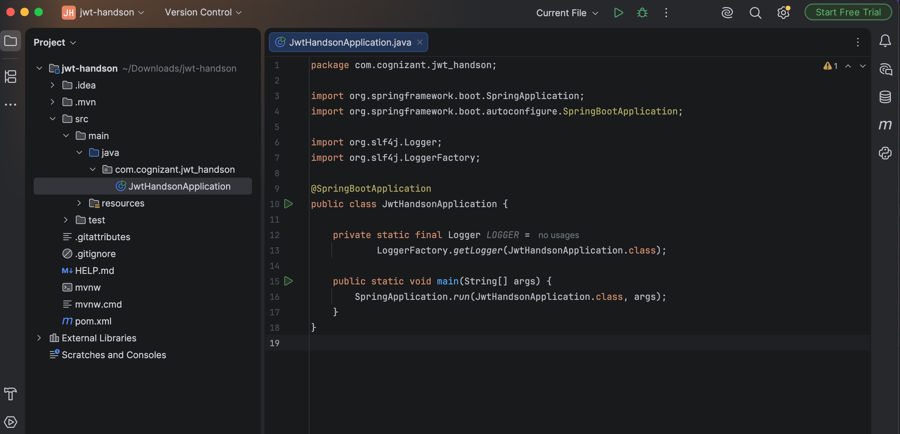
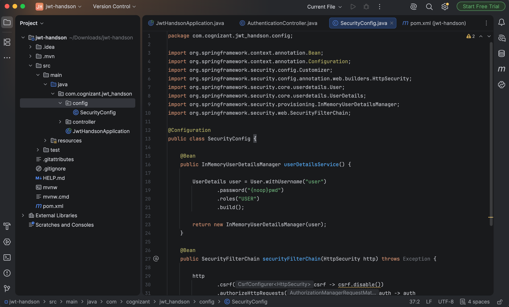
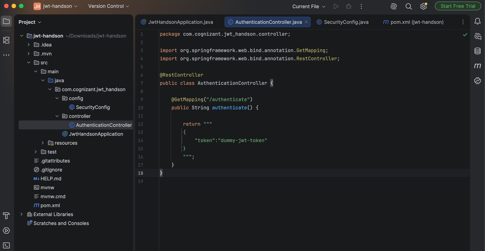
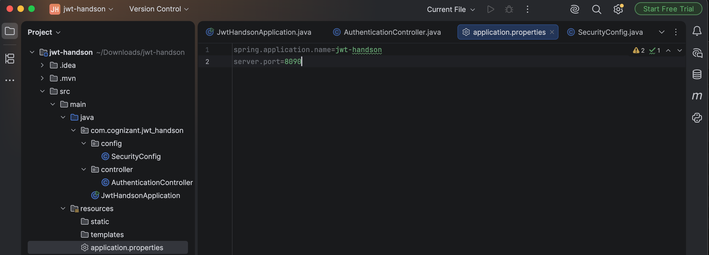
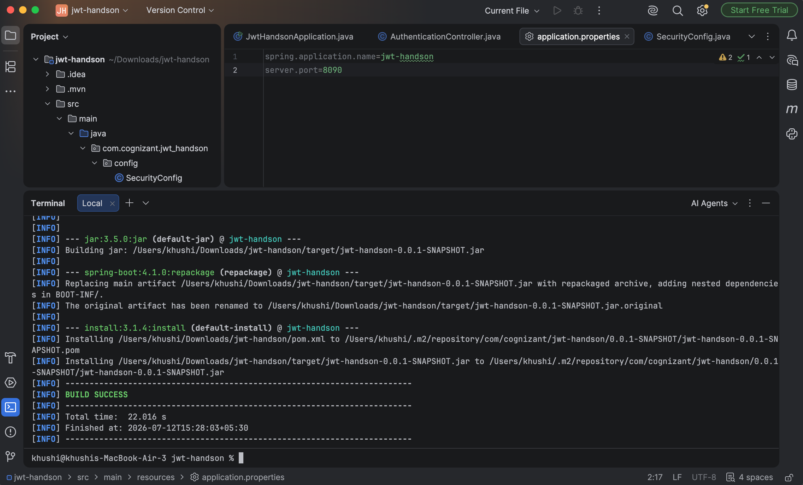
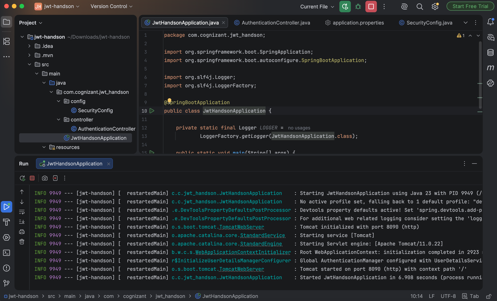
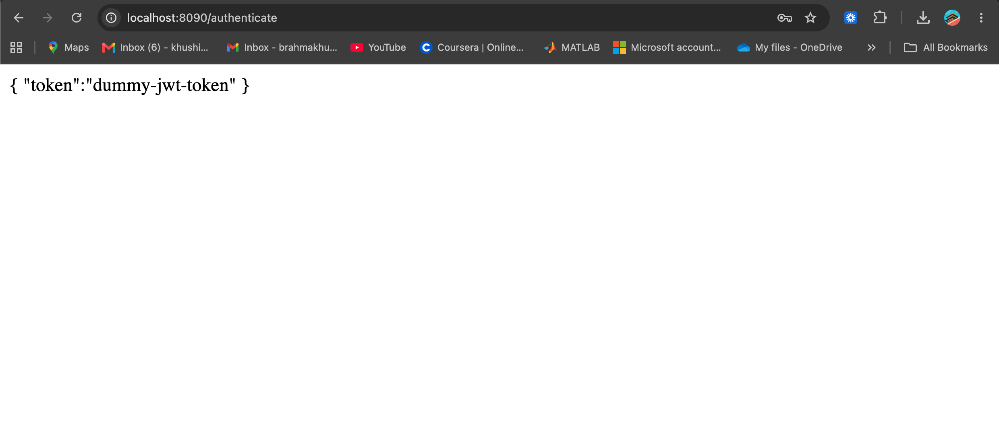
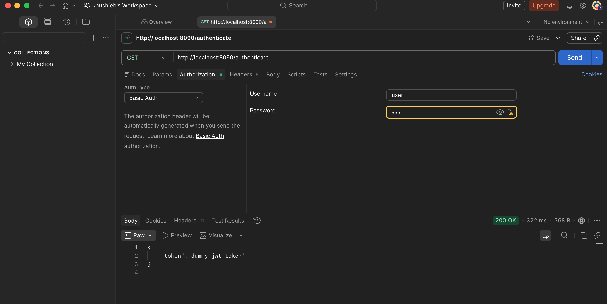
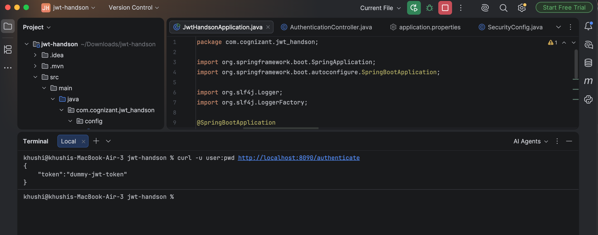

# Exercise - Create Authentication Service that Returns JWT

## Objective
Develop a Spring Boot application that provides an authentication service using Spring Security. The service authenticates a user using HTTP Basic Authentication and returns a dummy JSON Web Token (JWT) upon successful authentication.

---

## Project Structure
```
Create-authentication-service-that-returns-JWT/
│
├── pom.xml
├── README.md
├── src
│   ├── main
│   │   ├── java
│   │   │   └── com
│   │   │       └── cognizant
│   │   │           └── jwt_handson
│   │   │               ├── JwtHandsonApplication.java
│   │   │               ├── config
│   │   │               │   └── SecurityConfig.java
│   │   │               └── controller
│   │   │                   └── AuthenticationController.java
│   │   └── resources
│   │       └── application.properties
│   └── test
│       └── java
│
└── images
    ├── project_structure.png
    ├── main_class.png
    ├── security_config.png
    ├── authentication_controller.png
    ├── application_properties.png
    ├── build_success.png
    ├── application_running.png
    ├── browser_output.png
    ├── postman_response.png
    └── curl_output.png
```

---

# Technologies Used
- Java 17
- Spring Boot
- Spring Web
- Spring Security
- Maven
- REST API
- HTTP Basic Authentication
- JWT (Dummy Token)
- Postman

---

# Implementation Steps

## 1. Create Spring Boot Project
Created a new Maven-based Spring Boot project named **jwt-handson** using Spring Initializr.
Dependencies included:
- Spring Web
- Spring Security
- Spring Boot DevTools

### Screenshot


---

## 2. Configure Main Application
Updated the main Spring Boot application class and configured logging.

### Screenshot


---

## 4. Configure Spring Security
Created `SecurityConfig.java`.

Configuration includes:
- HTTP Basic Authentication
- In-memory user authentication
- Username: **user**
- Password: **pwd**
- Disabled CSRF protection
- Secured all endpoints
### Screenshot


---

## 5. Create Authentication Controller
Implemented `AuthenticationController.java`.

Created the endpoint:
```
GET /authenticate
```

The endpoint returns a dummy JWT token after successful authentication.
### Screenshot


---

## 6. Configure Application Properties
Configured the application to run on port **8090**.
```properties
server.port=8090
```

### Screenshot


---

## 7. Build the Project
Compiled the application successfully using Maven.
```bash
./mvnw clean install
```

### Screenshot


---

## 8. Run the Application
Started the Spring Boot application successfully.
### Screenshot


---

## 9. Test Authentication in Browser
Accessed the endpoint:
```
http://localhost:8090/authenticate
```

Entered the credentials:
- Username: **user**
- Password: **pwd**
Successfully received the dummy JWT token.
### Screenshot


---

## 10. Test Authentication Using Postman
Performed a GET request.
```
GET http://localhost:8090/authenticate
```

Authorization:
- Basic Auth
- Username: **user**
- Password: **pwd**
Received the JSON response containing the dummy JWT.
### Screenshot


---

## 11. Test Authentication Using cURL
Executed the following command:
```bash
curl -u user:pwd http://localhost:8090/authenticate
```

Received the JWT response successfully.
### Screenshot


---

# Sample Request=
```http
GET http://localhost:8090/authenticate
```

---

# Authentication
```
Username : user
Password : pwd
```

---

# Sample Response
```json
{
    "token": "dummy-jwt-token"
}
```

---

# Features
- Spring Boot REST API
- Spring Security Integration
- HTTP Basic Authentication
- In-memory User Authentication
- Dummy JWT Token Generation
- REST Controller
- Maven Build Support
- Browser Testing
- Postman Testing
- cURL Testing

---

# Result
Successfully implemented an authentication service using Spring Boot and Spring Security. The application authenticates users through HTTP Basic Authentication and returns a dummy JWT token upon successful login. The service was verified using a web browser, Postman, and cURL.
