# Exercise – Creating Microservices for Account and Loan

## Objective
The objective of this exercise is to create two independent Spring Boot RESTful microservices:
- Account Microservice
- Loan Microservice
Each microservice is developed as a separate Maven project with its own REST controller and runs independently on different ports.

---

## Technologies Used
- Java 17
- Spring Boot
- Spring Web
- Maven
- IntelliJ IDEA
- Postman

---

# Account Microservice

## Step 1: Create Spring Boot Project
Created a Maven Spring Boot project using Spring Initializr.
**Project Details**
- Group: `com.cognizant`
- Artifact: `account`

Dependencies:
- Spring Web
- Spring Boot DevTools

---

## Step 2: Open Project in IntelliJ
Imported the generated project into IntelliJ IDEA.
### Screenshot
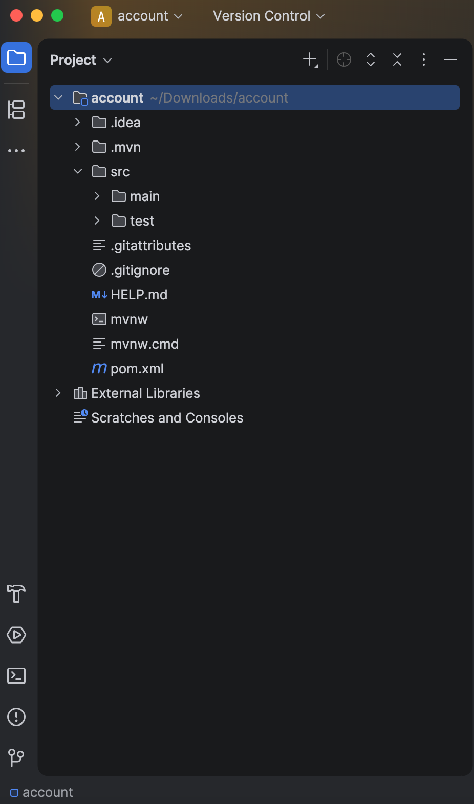

---

## Step 3: Create Account Model
Created the `Account` model class with the following fields:
- number
- type
- balance
### Screenshot
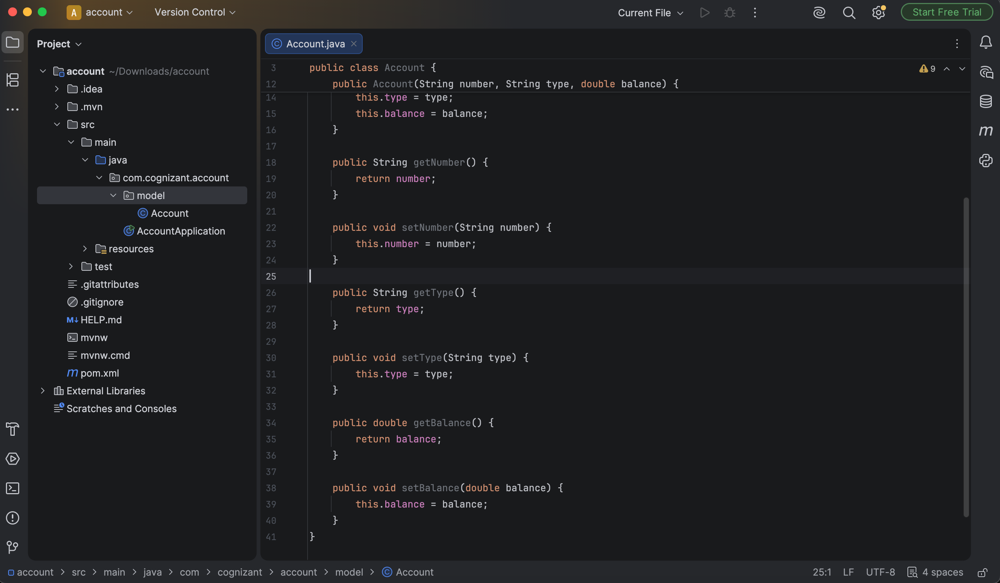

---

## Step 4: Create REST Controller
Created `AccountController.java`.
Implemented the endpoint:
```text
GET /accounts/{number}
```
Returns dummy account details.
### Screenshot
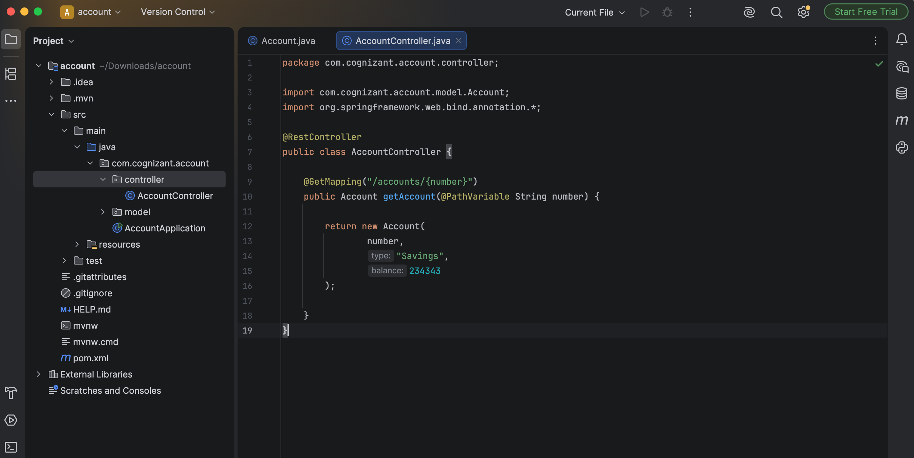

---

## Step 5: Run the Application
Started the Account microservice.
Runs on:
```text
http://localhost:8080
```

### Screenshot
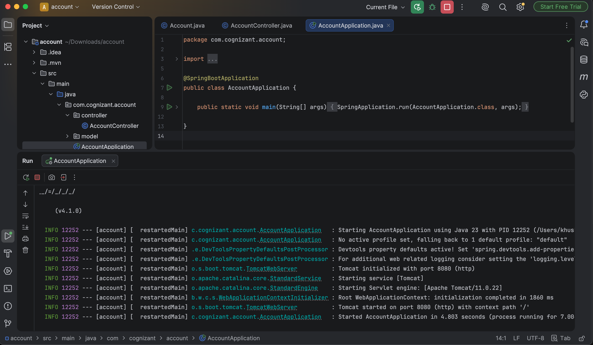

---

## Step 6: Test in Browser
Opened:
```text
http://localhost:8080/accounts/00987987973432
```
Received JSON response successfully.
### Screenshot
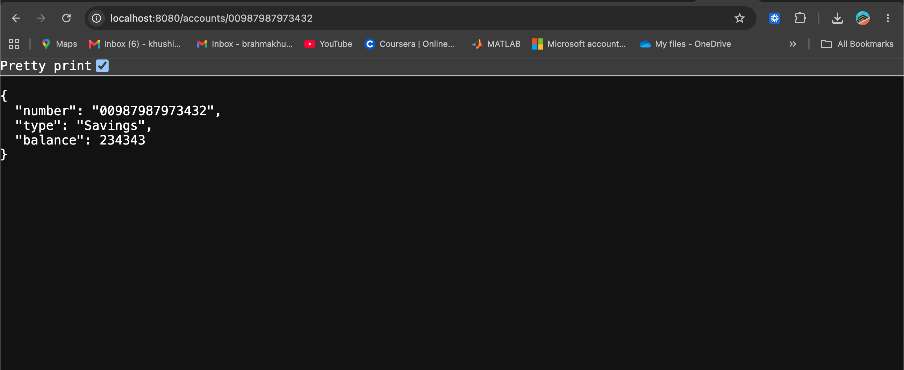

---

## Step 7: Test Using Postman
Sent a GET request using Postman.
```
GET http://localhost:8080/accounts/00987987973432
```
Response returned successfully.
### Screenshot
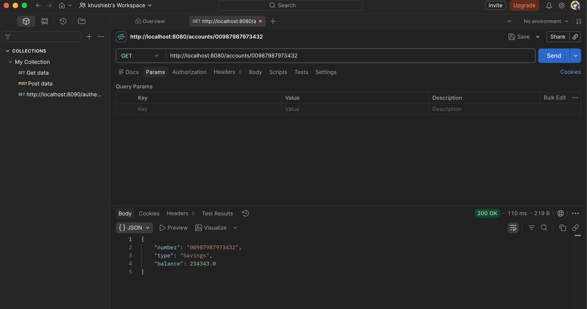

---

# Loan Microservice

## Step 8: Create Spring Boot Project
Created another Maven Spring Boot project.
**Project Details**
- Group: `com.cognizant`
- Artifact: `loan`

Dependencies:
- Spring Web
- Spring Boot DevTools

---

## Step 9: Open Project in IntelliJ
Imported the Loan project into IntelliJ.
### Screenshot
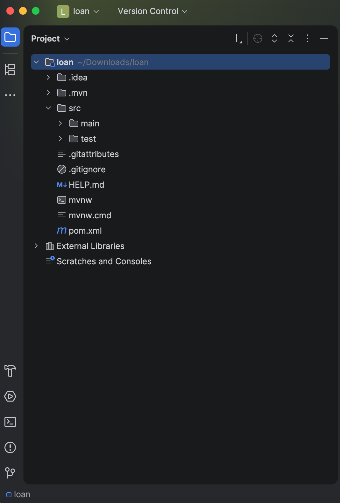

---

## Step 10: Create Loan Model
Created `Loan.java`.

Fields:
- number
- type
- loan
- emi
- tenure
### Screenshot
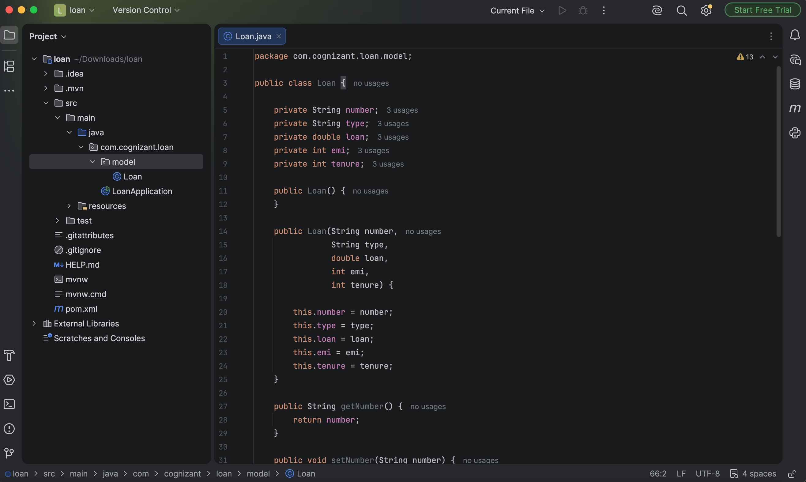

---

## Step 11: Create REST Controller
Created `LoanController.java`.
Implemented endpoint:
```text
GET /loans/{number}
```

Returns dummy loan details.
### Screenshot
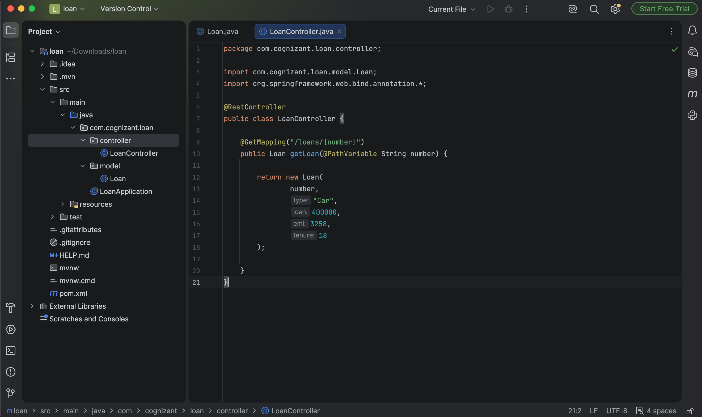

---

## Step 12: Configure Server Port
Updated `application.properties`:
```properties
server.port=8081
```

This allows the Loan microservice to run independently without conflicting with the Account microservice.
### Screenshot
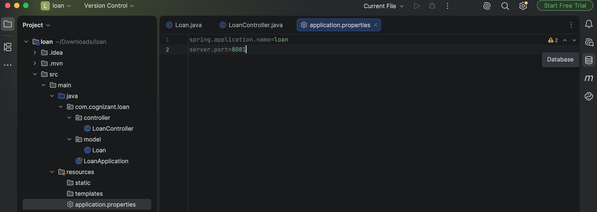

---

## Step 13: Run Loan Microservice
Started the Loan application.
Runs on:
```text
http://localhost:8081
```

### Screenshot
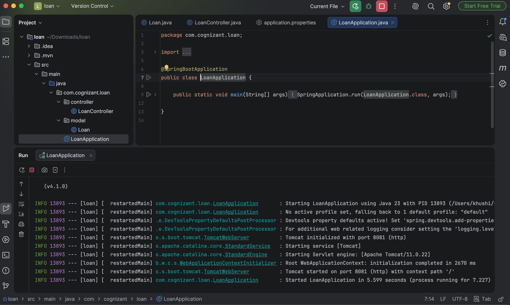

---

## Step 14: Test in Browser
Opened:
```text
http://localhost:8081/loans/H00987987972342
```
Received the expected JSON response.
### Screenshot
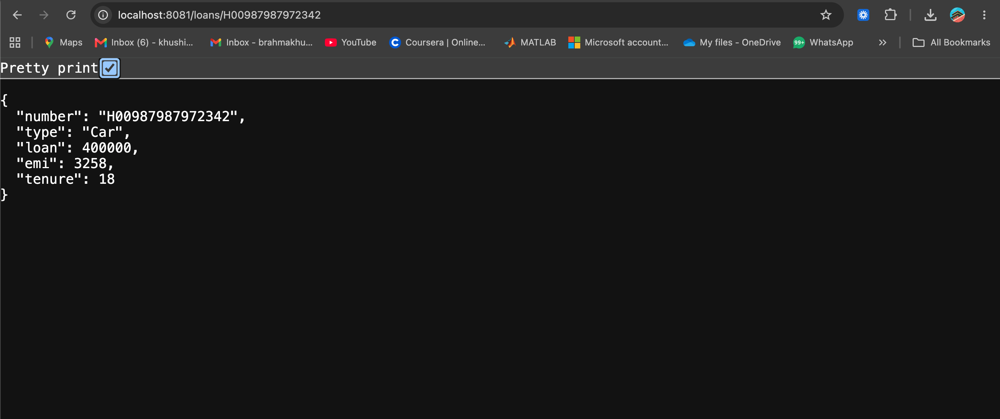

---

## Step 15: Test Using Postman
Sent a GET request.
```
GET http://localhost:8081/loans/H00987987972342
```
Received the expected JSON response.
### Screenshot
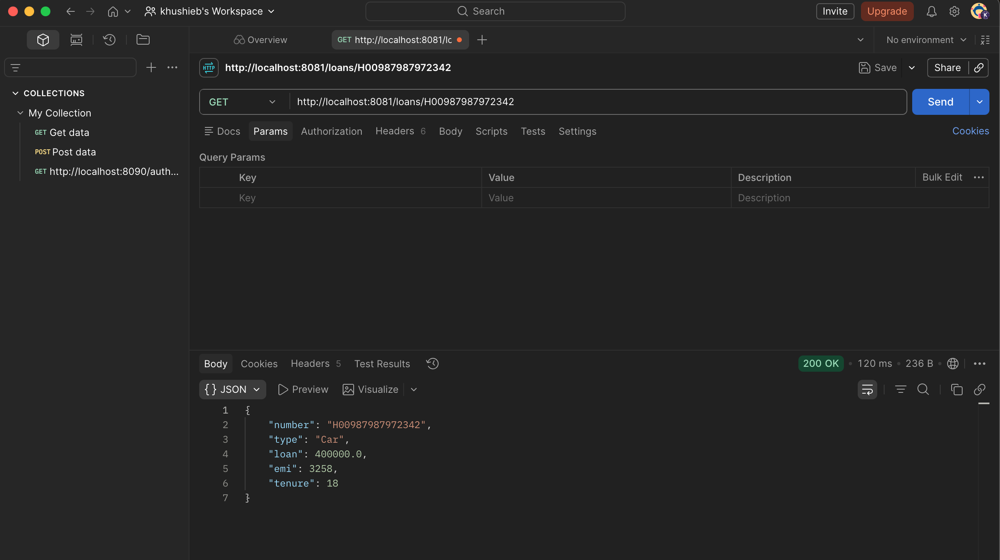

---

## Step 16: Run Both Microservices
Successfully ran both microservices simultaneously.

| Microservice | Port |
|--------------|------|
| Account | 8080 |
| Loan | 8081 |

Both services worked independently without port conflicts.
### Screenshot
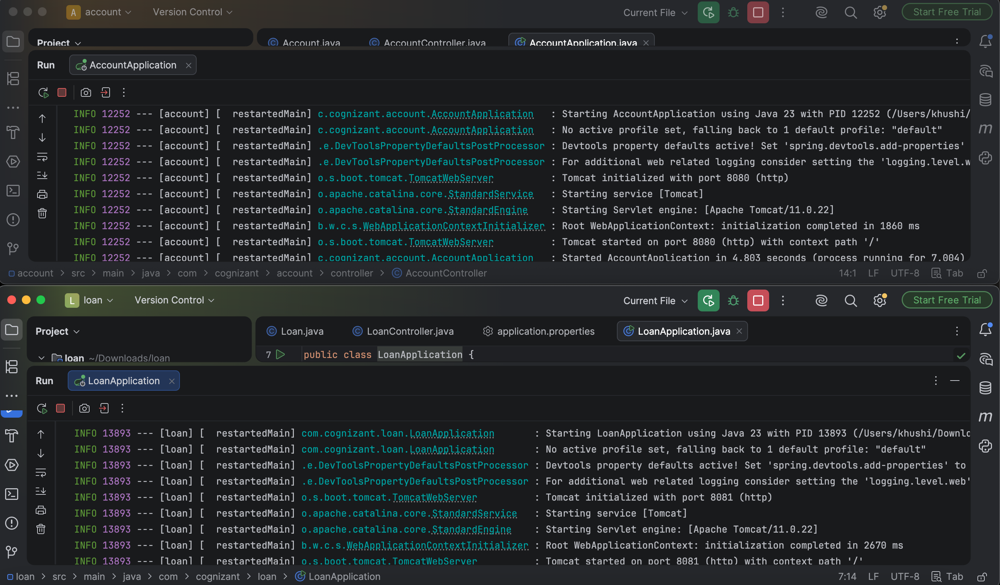

---

# Project Structure
```
Microservices-with-API-gateway/
│
├── account/
│   ├── src/
│   └── pom.xml
│
├── loan/
│   ├── src/
│   └── pom.xml
│
├── images/
│   ├── account_project.png
│   ├── account_model.png
│   ├── account_controller.png
│   ├── account_running.png
│   ├── account_browser.png
│   ├── account_postman.png
│   ├── loan_project.png
│   ├── loan_model.png
│   ├── loan_controller.png
│   ├── application_properties.png
│   ├── loan_running.png
│   ├── loan_browser.png
│   ├── loan_postman.png
│   └── both_services_running.png
│
└── README.md
```

---

# Learning Outcome
Successfully created two independent Spring Boot RESTful microservices:
- Account Microservice
- Loan Microservice
Implemented REST controllers, model classes, and Maven-based Spring Boot projects. Configured separate server ports to enable both services to run simultaneously, and verified the REST APIs using both a web browser and Postman.
