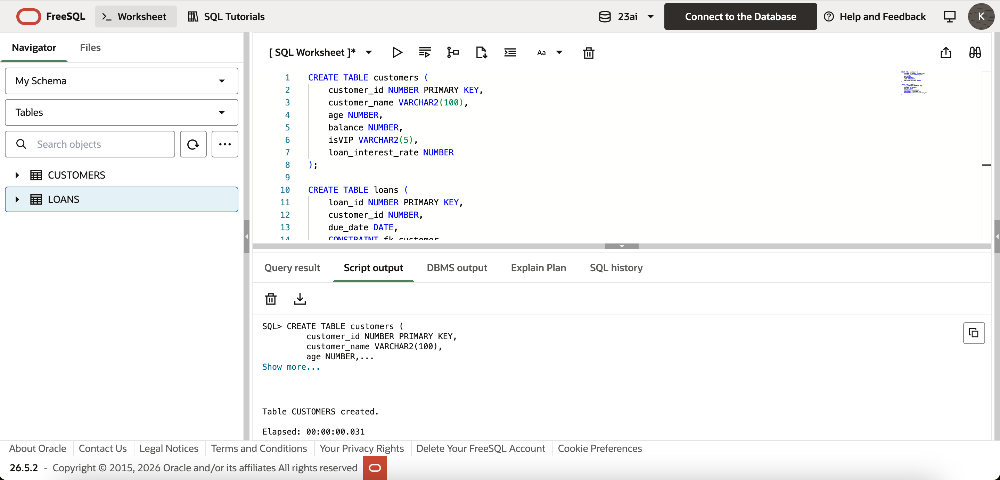
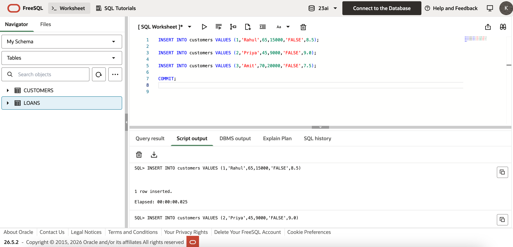
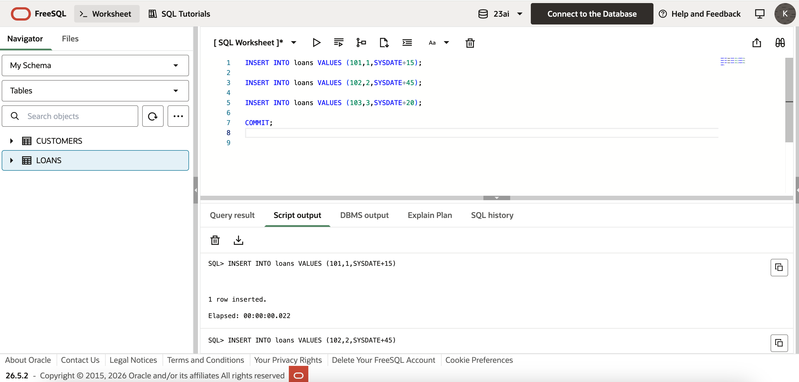
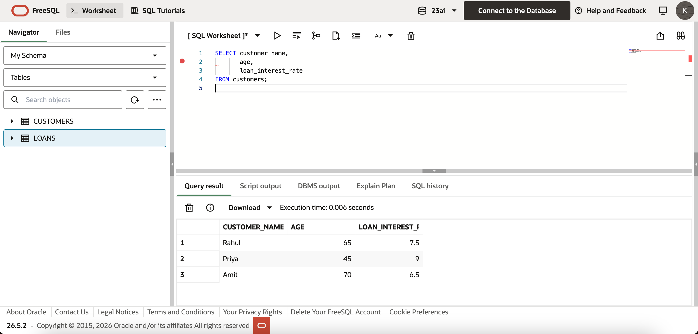
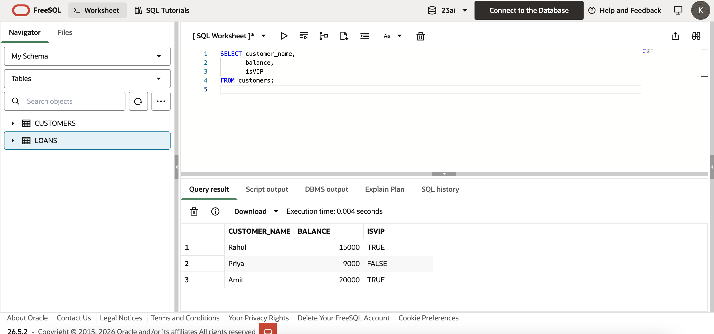
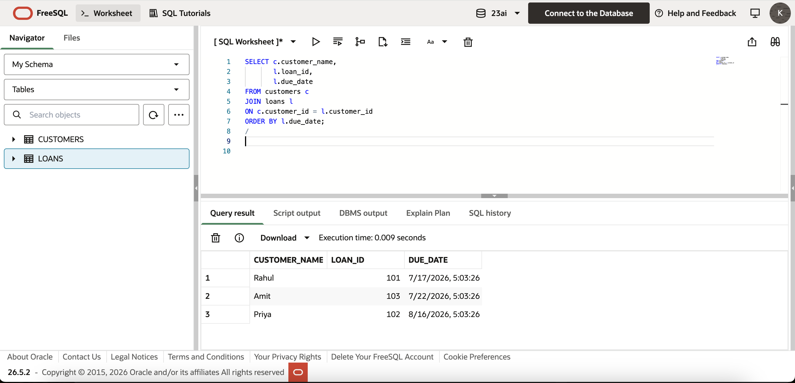

# Exercise 1 - Control Structures (PL/SQL)

## Objective
The objective of this exercise is to understand and implement **PL/SQL Control Structures** using loops, conditional statements, and cursors to automate common banking operations.

---

## Scenario
A banking system needs to automate several routine operations:
- Apply a 1% discount on loan interest rates for customers above 60 years of age.
- Promote customers with a balance greater than ₹10,000 to VIP status.
- Generate loan due reminders for customers whose loan repayment is due within the next 30 days.

---

## Technologies Used
- Oracle Live SQL
- Oracle SQL
- PL/SQL

---

## Project Structure
```text
Exercise-1-Control-Structures
│
├── create_tables.sql
├── insert_data.sql
├── scenario1.sql
├── scenario2.sql
├── scenario3.sql
├── README.md
│
└── images
    ├── create_tables.png
    ├── insert_data_customers.png
    ├── insert_data_loans.png
    ├── scenario1_result.png
    ├── scenario2_result.png
    └── scenario3_output.png
```

---

## Files Description
| File | Description |
|------|-------------|
| create_tables.sql | Creates the `customers` and `loans` tables |
| insert_data.sql | Inserts sample customer and loan records |
| scenario1.sql | Applies a 1% loan interest discount to customers above 60 years |
| scenario2.sql | Promotes customers with a balance greater than ₹10,000 to VIP status |
| scenario3.sql | Displays reminders for loans due within the next 30 days |

---

# Scenario 1
### Requirement
Apply a **1% discount** to the loan interest rate of customers who are **above 60 years of age**.

### PL/SQL Concepts Used
- FOR LOOP
- IF Statement
- UPDATE Statement
- COMMIT
- DBMS_OUTPUT

---

# Scenario 2
### Requirement
Promote customers to **VIP** status if their account balance exceeds **₹10,000**.

### PL/SQL Concepts Used
- FOR LOOP
- IF Statement
- UPDATE Statement
- COMMIT
- DBMS_OUTPUT

---

# Scenario 3
### Requirement
Generate reminder messages for customers whose loan repayment is due within the next **30 days**.

### PL/SQL Concepts Used
- Cursor FOR LOOP
- JOIN
- Date Functions
- DBMS_OUTPUT

---

# Screenshots

## 1. Tables Created


---

## 2. Sample Data Inserted



---

## 4. Scenario 1 Result


---

## 5. Scenario 2 Result


---

## 6. Scenario 3 Result


---

# Conclusion
This exercise demonstrates how PL/SQL control structures can automate common banking operations such as updating loan interest rates, promoting eligible customers to VIP status, and generating loan reminders. It also provides practical experience with loops, conditional statements, SQL updates, and cursor processing in Oracle PL/SQL.

---

**Author:** Khushie Brahma  
