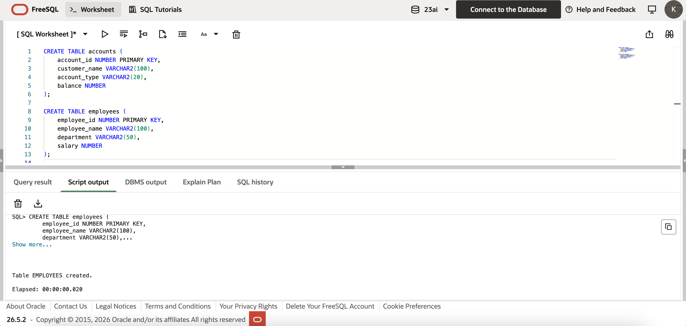
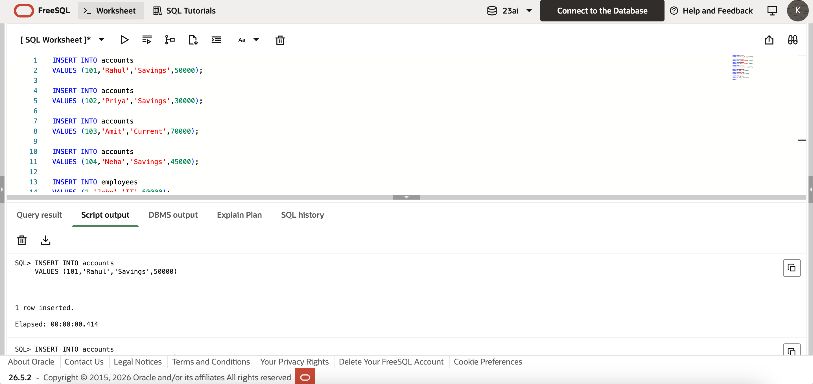
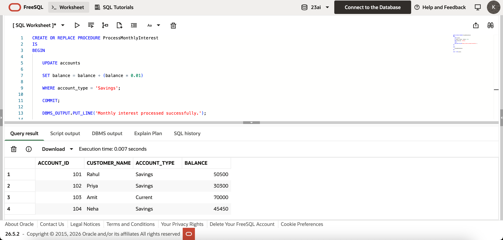
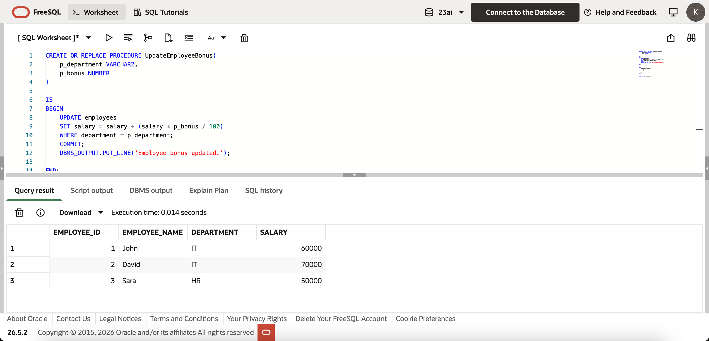
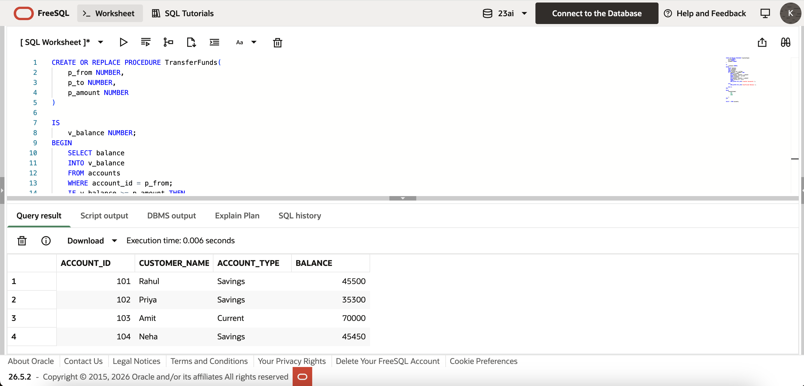

# Exercise 3 - Stored Procedures

---

## Objective
The objective of this exercise is to understand and implement Oracle PL/SQL Stored Procedures for automating common banking operations.

---

## Scenarios

### Scenario 1
Process monthly interest for all Savings Accounts by applying a 1% interest rate.

### Scenario 2
Update employee salaries by adding a bonus percentage for a given department.

### Scenario 3
Transfer funds between two accounts after verifying sufficient balance.

---

## Technologies Used
- Oracle Live SQL
- Oracle SQL
- PL/SQL

---

## Files
- create_tables.sql
- insert_data.sql
- scenario1.sql
- scenario2.sql
- scenario3.sql

---

## Concepts Used
- Stored Procedures
- Parameters
- Variables
- IF Statements
- UPDATE
- COMMIT
- DBMS_OUTPUT
- SELECT INTO

---

## Screenshots

### Tables Created

### Sample Data

### Scenario 1

### Scenario 2

### Scenario 3

---

## Conclusion
This exercise demonstrates the practical use of PL/SQL Stored Procedures to automate repetitive banking tasks such as applying monthly interest, updating employee bonuses, and securely transferring funds between accounts.
