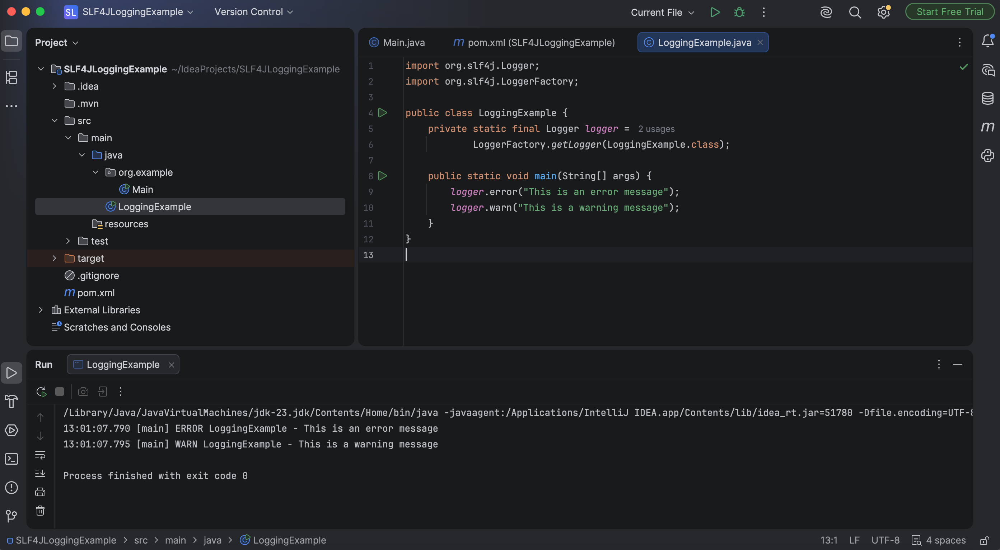

# Exercise 1: Logging Error Messages and Warning Levels

## Objective
Demonstrate logging of warning and error messages using the SLF4J Logging Framework with Logback.

---

## Technologies Used
- Java
- Maven
- SLF4J
- Logback
- IntelliJ IDEA

---

## Dependencies
- slf4j-api 1.7.30
- logback-classic 1.2.3

---

## Project Structure
```text
SLF4JLoggingExample
│
├── pom.xml
├── README.md
├── src
│
│   └── main
│       └── java
│             LoggingExample.java
│
└── screenshots
```

---

## Steps Performed
1. Created a Maven project.
2. Added SLF4J and Logback dependencies.
3. Created a logger using `LoggerFactory`.
4. Logged an ERROR message.
5. Logged a WARNING message.
6. Executed the application successfully.

---

## Output
### Console Output


---

## Result
Successfully implemented logging using the SLF4J framework and displayed warning and error messages in the console.
