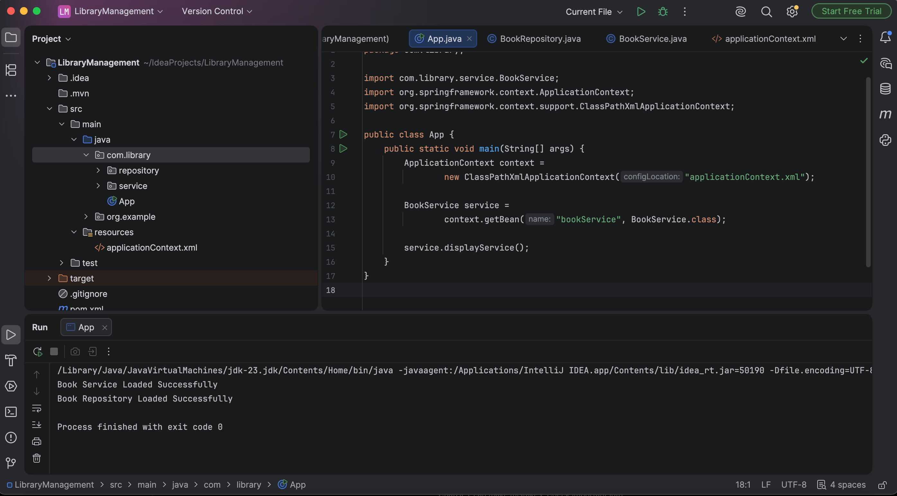

# Exercise 1: Configuring a Basic Spring Application

## Objective
Configure a basic Spring application using XML configuration and Maven.

---

## Technologies Used
- Java 17
- Spring Framework 5.3.30
- Maven
- IntelliJ IDEA

---

## Project Structure
```text
LibraryManagement
├── pom.xml
├── src
│   ├── main
│   │   ├── java
│   │   │   └── com.library
│   │   │       ├── App.java
│   │   │       ├── service
│   │   │       │   └── BookService.java
│   │   │       └── repository
│   │   │           └── BookRepository.java
│   │   └── resources
│   │       └── applicationContext.xml
└── screenshots
```

---

## Steps Performed
1. Created a Maven project.
2. Added Spring Context dependency.
3. Created `BookService` and `BookRepository` classes.
4. Configured Spring beans in `applicationContext.xml`.
5. Loaded the Spring container using `ClassPathXmlApplicationContext`.
6. Retrieved the `BookService` bean and executed the application successfully.

---

## Output
### Console Output


---

## Result
Successfully configured and executed a basic Spring application using XML-based configuration and Maven.
