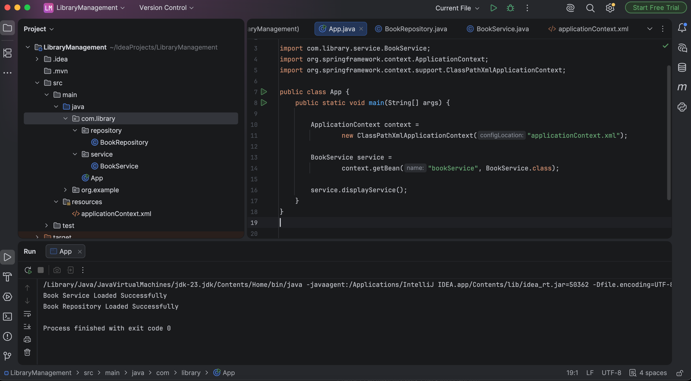

# Exercise 2: Implementing Dependency Injection

## Objective
Implement Dependency Injection using Spring IoC Container and XML configuration.

---

## Technologies Used
- Java 17
- Spring Framework 5.3.30
- Maven
- IntelliJ IDEA

---

## Steps Performed
1. Created `BookRepository` class.
2. Created `BookService` class with a setter method.
3. Configured Spring beans in `applicationContext.xml`.
4. Injected `BookRepository` into `BookService` using XML.
5. Loaded the Spring context in `App.java`.
6. Retrieved the bean and executed the application successfully.

---

## Dependency Injection
The dependency was injected using:
```xml
<property name="repository" ref="bookRepository"/>
```

---

## Output
### Console Output


---

## Result
Successfully implemented Dependency Injection using Spring IoC Container and XML-based configuration.
