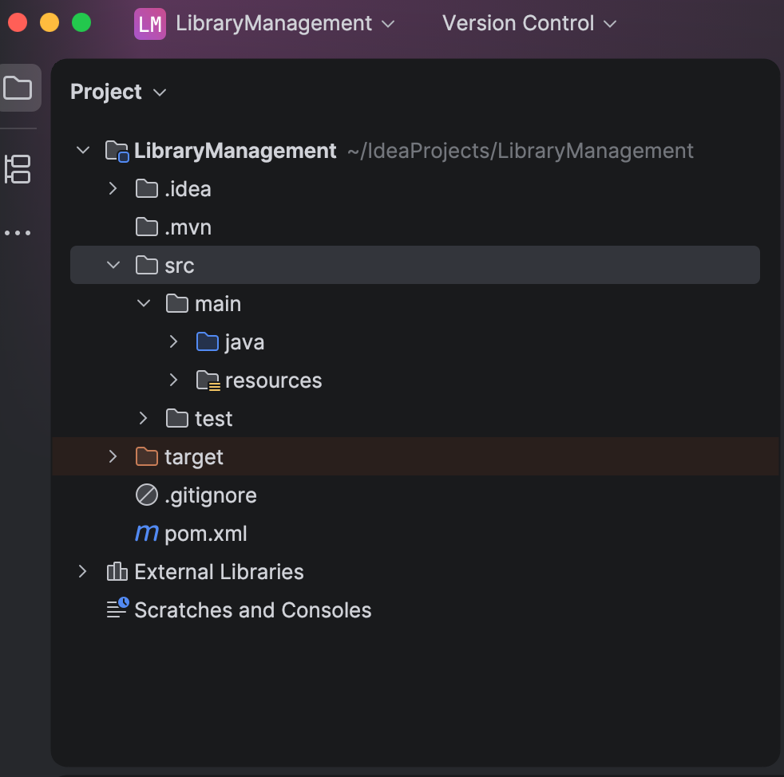
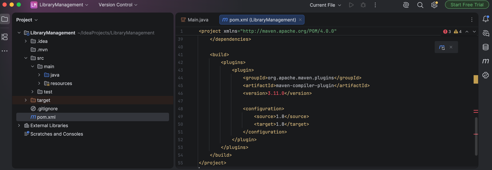
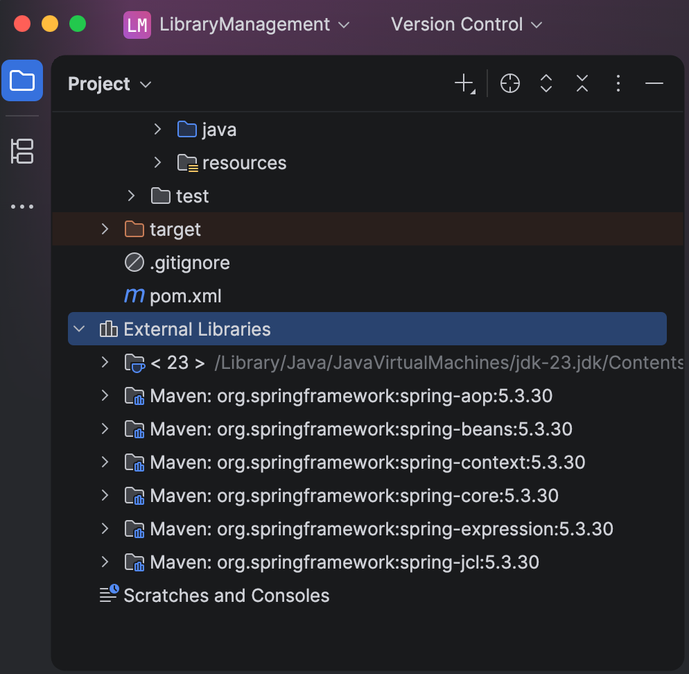
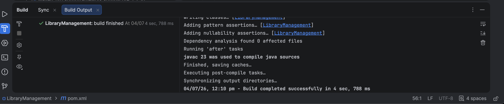

# Exercise 4: Creating and Configuring a Maven Project

## Objective
Create and configure a Maven project for a Spring application by adding Spring dependencies and configuring the Maven Compiler Plugin.

---

## Technologies Used
- Java 17
- Maven
- Spring Context
- Spring AOP
- Spring WebMVC
- IntelliJ IDEA

---

## Steps Performed
1. Opened the Maven project.
2. Added Spring Context dependency.
3. Added Spring AOP dependency.
4. Added Spring WebMVC dependency.
5. Configured the Maven Compiler Plugin for Java 1.8 compatibility.
6. Reloaded the Maven project.
7. Verified all dependencies were downloaded.
8. Built the project successfully.

---

## Screenshots

### Project Structure

### Maven Compiler Plugin

### External Libraries

### Build Success

---

## Result
Successfully created and configured a Maven project with the required Spring dependencies and Maven Compiler Plugin. The project builds successfully and is ready for further Spring development.
