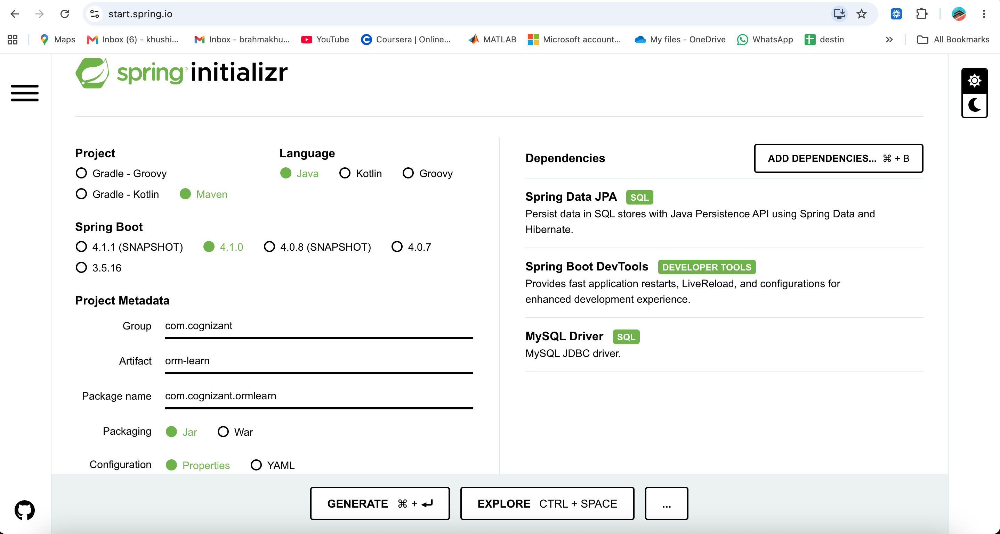
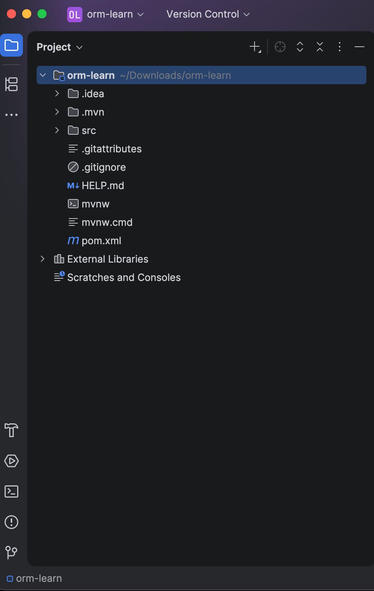
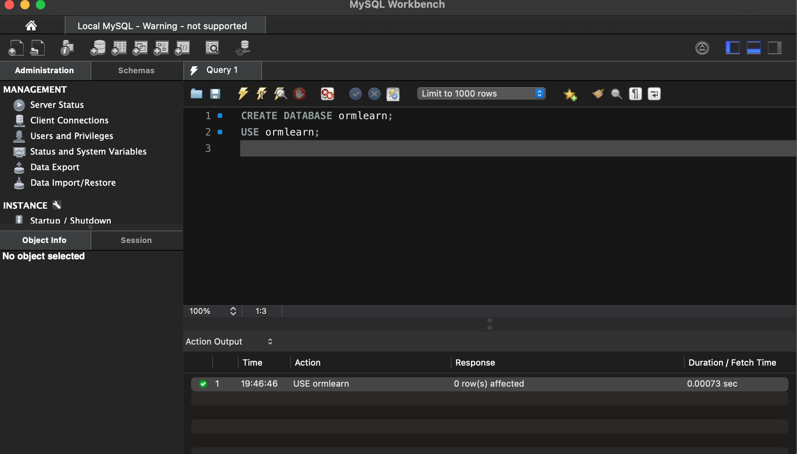
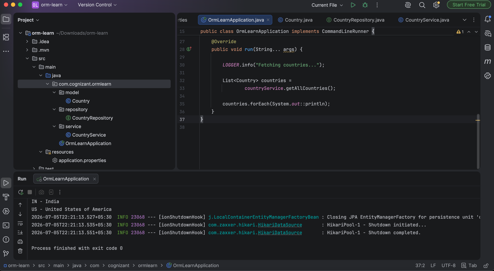

# Spring Data JPA – Quick Example

### Objective
The objective of this hands-on exercise is to understand the fundamentals of **Spring Data JPA** by creating a simple Spring Boot application that connects to a MySQL database, maps a database table using JPA entities, performs data retrieval through a repository interface, and displays the results using a service layer.

---

## Technologies Used
- Java
- Spring Boot
- Spring Data JPA
- Hibernate
- Maven
- MySQL Server
- IntelliJ IDEA
- Git & GitHub

---

## Project Structure
```
spring-data-jpa-handson/
│
├── pom.xml
├── README.md
├── src
│
├── images
│   ├── 01_spring_initializer.png
│   ├── 02_project_structure.png
│   ├── 03_database_created.png
│   └── 12_final_output.png
```

---

## Database Setup
Created a MySQL database named:
```
ormlearn
```

Created the `country` table:
```sql
CREATE TABLE country (
    co_code VARCHAR(2) PRIMARY KEY,
    co_name VARCHAR(50)
);
```

Inserted sample records:
```sql
INSERT INTO country VALUES ('IN','India');
INSERT INTO country VALUES ('US','United States of America');
```

---

## Features Implemented
- Spring Boot project creation using Spring Initializr
- MySQL database configuration
- Spring Data JPA integration
- Hibernate ORM configuration
- Country entity mapping using JPA annotations
- Repository implementation using JpaRepository
- Service layer implementation
- Retrieval of all countries from the database
- Console output verification

---

### 1. Spring Initializr Project Creation



---

### 2. Project Structure


---

### 3. MySQL Database Creation


---

### 12. Final Output


---
