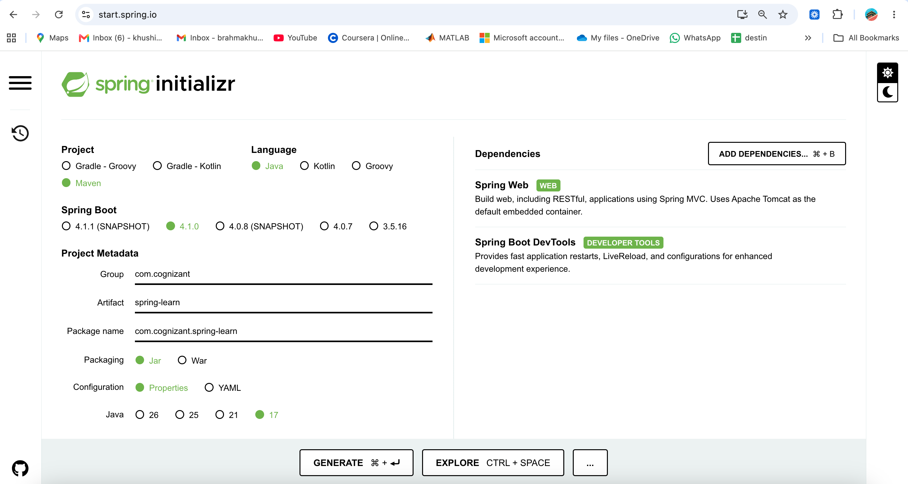
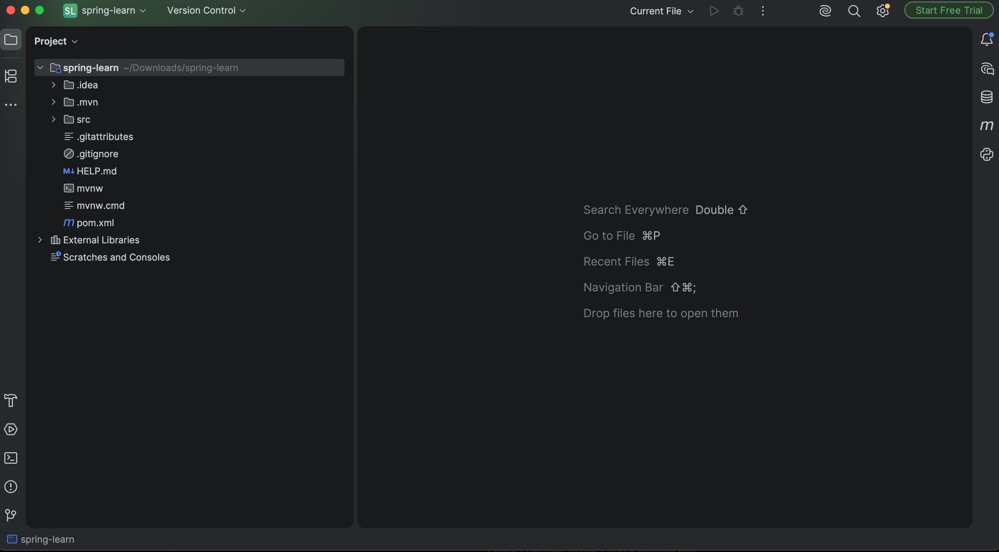
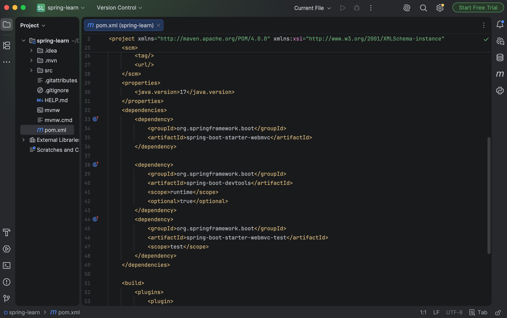
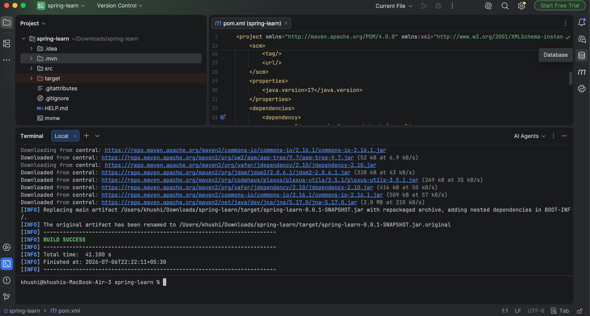
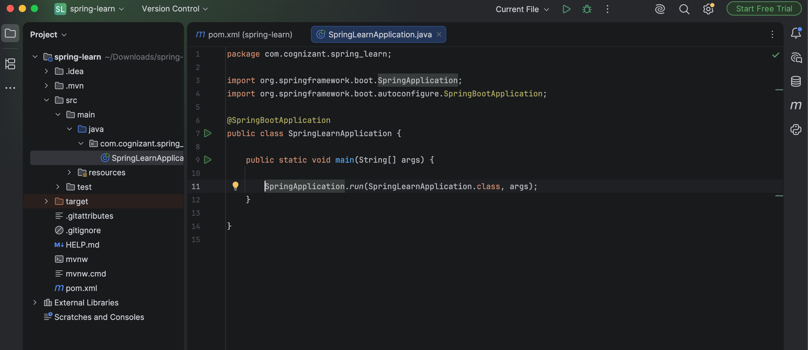
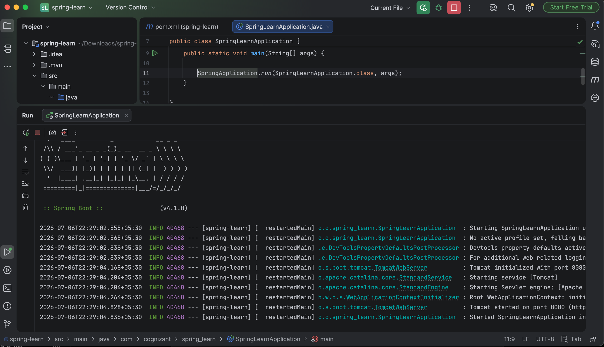

# Create a Spring Web Project using Maven

## Objective
The objective of this hands-on exercise is to create a Spring Boot web application using Maven, understand the standard project structure, configure project dependencies, and successfully build and run the application.

---

## Technologies Used
- Java 17
- Spring Boot
- Spring Web
- Spring Boot DevTools
- Maven
- IntelliJ IDEA
- Git
- GitHub

---

## Software Requirements
- Java JDK 17 or later
- IntelliJ IDEA
- Maven (or Maven Wrapper included with the project)
- Git

---

## Project Creation Steps

# Step 1: Create Spring Boot Project
Created a new Spring Boot project using **Spring Initializr** with the following configuration:
- Project: Maven
- Language: Java
- Group: com.cognizant
- Artifact: spring-learn
- Dependencies:
  - Spring Web
  - Spring Boot DevTools

## Screenshot


---

# Step 2: Open the Project in IntelliJ IDEA
Opened the generated project in IntelliJ IDEA and allowed Maven to download all required dependencies.

## Screenshot


---

# Step 3: Verify pom.xml Dependencies
Verified that the required Spring Boot dependencies were successfully added to the `pom.xml` file.

Dependencies included:
- Spring Boot Starter Web
- Spring Boot DevTools
- Spring Boot Starter Test

## Screenshot


---

# Step 4: Build the Project
Built the project successfully using Maven.

Commands used:
```bash
./mvnw clean
./mvnw package
```
The project compiled successfully without any errors.

## Screenshot


---

# Step 5: Spring Boot Main Class
Executed the `SpringLearnApplication.java` class.

The application starts using:
```java
SpringApplication.run(SpringLearnApplication.class, args);
```

## Screenshot


---

# Step 6: Run the Application
Successfully ran the Spring Boot application.
The embedded Tomcat server started successfully, confirming that the application was configured correctly.

## Screenshot


---

## Project Structure
```
Create-a-Spring-Web-Project-using-Maven/
│
├── pom.xml
├── README.md
├── src
│   ├── main
│   │   ├── java
│   │   └── resources
│   └── test
│       └── java
│
└── imagess
    ├── spring_initializer.png
    ├── project_opened.png
    ├── pom_dependencies.png
    ├── build_success.png
    ├── main_class.png
    ├── application_running.png
```

---

## Important Files

### pom.xml
Contains:
- Spring Boot parent configuration
- Maven build configuration
- Spring Web dependency
- Spring Boot DevTools dependency

---

### SpringLearnApplication.java
The entry point of the Spring Boot application.
It contains the `main()` method that starts the Spring application using:
```java
SpringApplication.run(SpringLearnApplication.class, args);
```

---

## Maven Build Lifecycle
The following Maven commands were executed:
```bash
./mvnw clean
```
Removes previous build files.
```bash
./mvnw package
```
Compiles the application, runs tests, and generates the executable JAR file.

---

## Conclusion
This hands-on exercise provided practical experience in creating a Spring Boot web application using Maven. It demonstrated how Maven manages project dependencies, how Spring Boot simplifies application development, and how IntelliJ IDEA can be used to build and run a Spring Boot project efficiently.

---

B.Tech Computer Science & Engineering

Cognizant Digital Nurture 4.0 – Java FSE Hands-on Exercises
