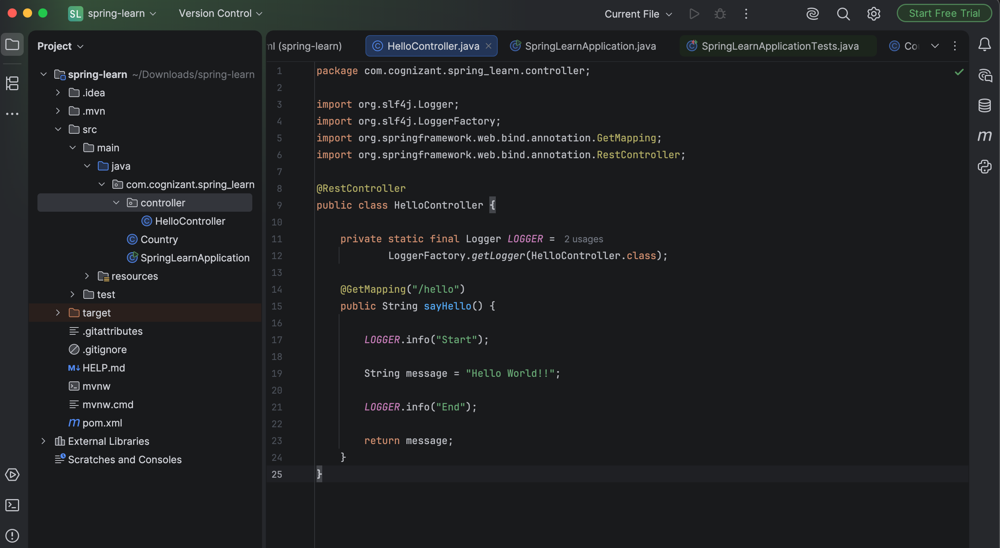
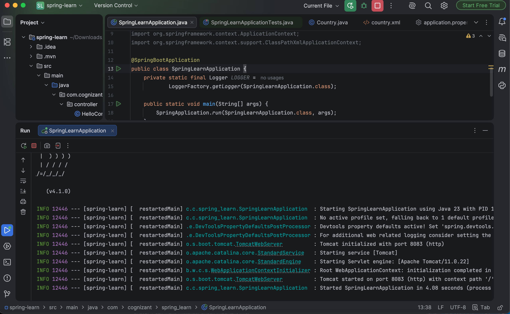
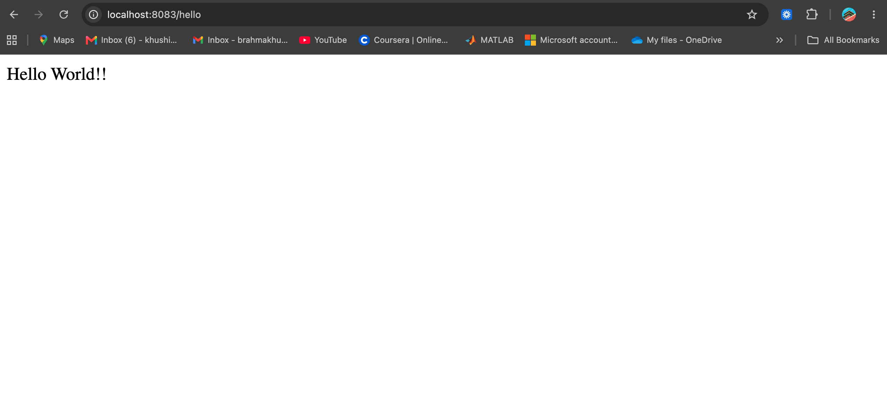
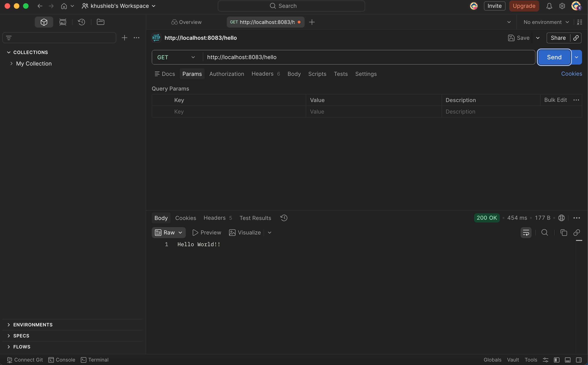
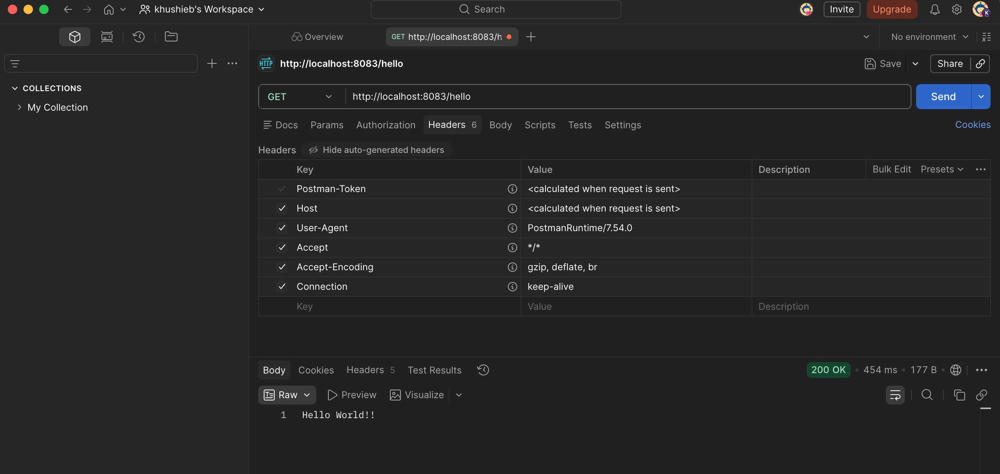

# Hello World RESTful Web Service

## Objective
The objective of this hands-on exercise is to create a simple RESTful Web Service using Spring Boot that returns the message **"Hello World!!"** when the `/hello` endpoint is accessed.

---

## Project Structure
```
├── pom.xml
├── README.md
├── src
│   ├── main
│   │   ├── java
│   │   │   └── com
│   │   │       └── cognizant
│   │   │           └── spring_learn
│   │   │               ├── SpringLearnApplication.java
│   │   │               └── controller
│   │   │                   └── HelloController.java
│   │   │
│   │   └── resources
│   │       └── application.properties
│   │
│   └── test
│       └── java
│           └── com
│               └── cognizant
│                   └── spring_learn
│                       └── SpringLearnApplicationTests.java
│
└── images
    ├── application_running.png
    ├── browser_output.png
    ├── build_success.png
    ├── hello_controller.png
    ├── main_class.png
    ├── pom_dependency.png
    ├── postman_output.png
    └── postman_headers.png
```

---

# Technologies Used
- Java 17
- Spring Boot
- Spring Web
- Maven
- IntelliJ IDEA
- Postman
- Google Chrome

---

# Steps Performed

Created the package:
```
com.cognizant.spring_learn.controller
```

Added the **HelloController.java** class.
Implemented the REST endpoint:
```
GET /hello
```

which returns
```
Hello World!!
```

Included debug logs at the beginning and end of the method.

### Screenshot


---

Executed the Spring Boot application successfully.
Verified that Tomcat started successfully without any errors.

### Screenshot


---

Tested the REST API in a web browser.
Request URL:
```
http://localhost:8083/hello
```

Response:
```
Hello World!!
```

### Screenshot


---

Tested the REST endpoint using Postman.
Method:
```
GET
```

URL:
```
http://localhost:8083/hello
```
Verified the response body.

### Screenshot


---

Verified the HTTP response headers in Postman.
Observed headers such as:
- Content-Type
- Content-Length
- Date
- Connection

### Screenshot


---

# Output
Browser Output
```
Hello World!!
```

Postman Response
```
Hello World!!
```

---

# HTTP Request
```
GET http://localhost:8083/hello
```

---

# Expected Response
```
Hello World!!
```

---

# Result
The Hello World RESTful Web Service was implemented successfully and tested using both a web browser and Postman. The endpoint returned the expected response and demonstrated the basics of creating REST APIs using Spring Boot.
