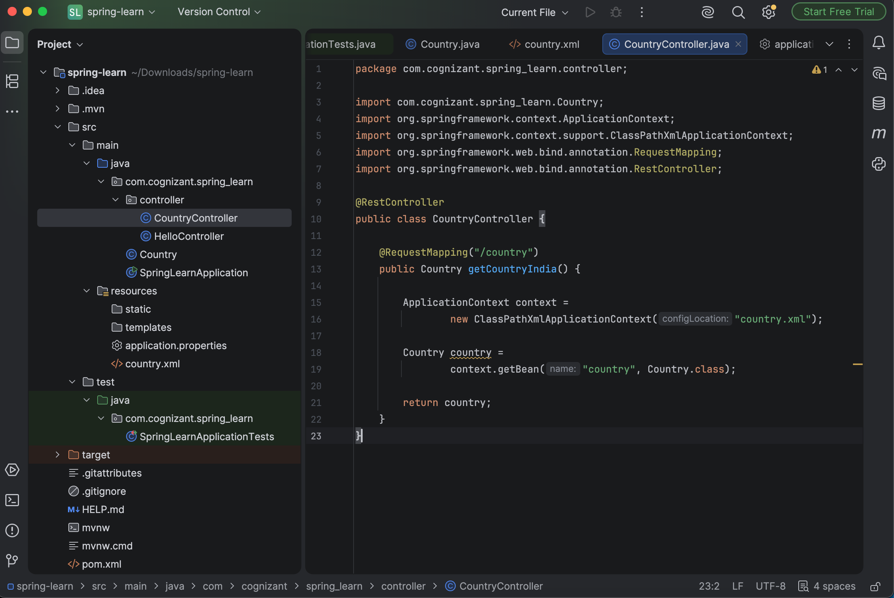
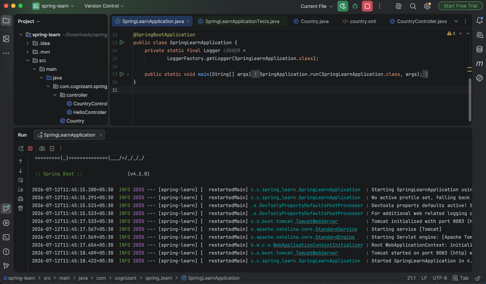
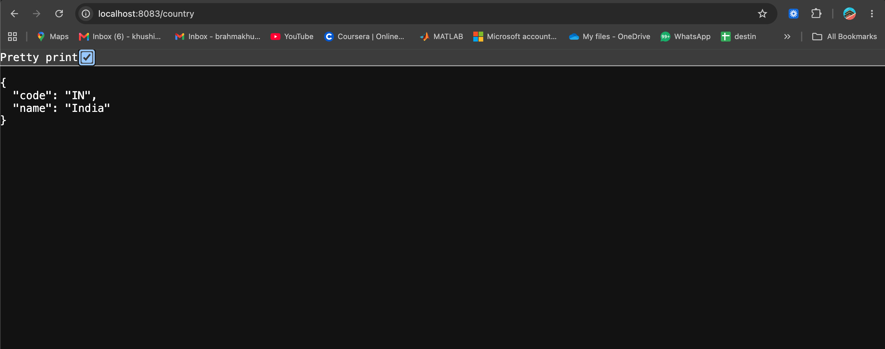
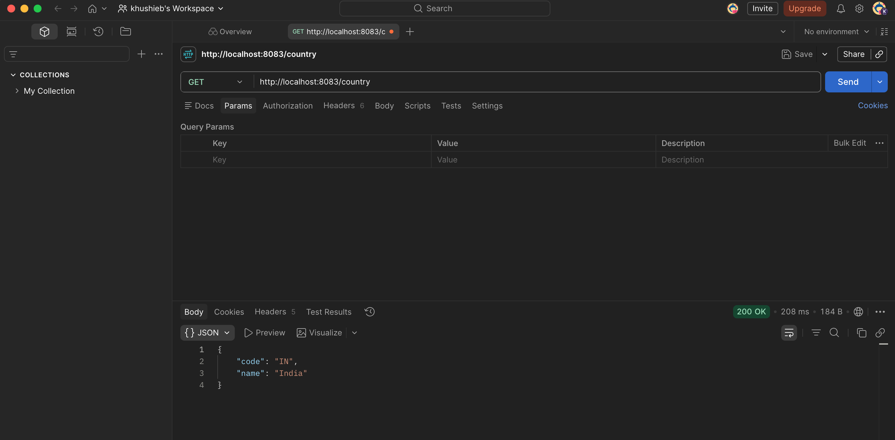
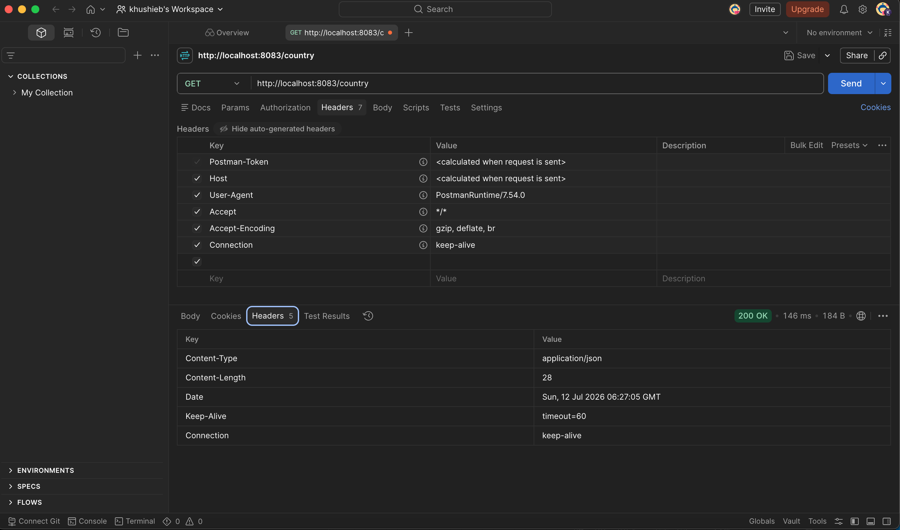

# Exercise - REST Country Web Service

## Objective
The objective of this hands-on exercise is to create a RESTful Web Service using Spring Boot that returns the details of a country (India) by reading the bean configuration from a Spring XML file.

---

## Project Structure
```
REST-Country-Web-Service/
│
├── pom.xml
├── README.md
├── src
│   ├── main
│   │   ├── java
│   │   │   └── com
│   │   │       └── cognizant
│   │   │           └── spring_learn
│   │   │               ├── Country.java
│   │   │               ├── SpringLearnApplication.java
│   │   │               └── controller
│   │   │                   ├── HelloController.java
│   │   │                   └── CountryController.java
│   │   │
│   │   └── resources
│   │       ├── application.properties
│   │       └── country.xml
│   │
│   └── test
│       └── java
│           └── com
│               └── cognizant
│                   └── spring_learn
│                       └── SpringLearnApplicationTests.java
│
└── images
    ├── project_structure.png
    ├── country_controller.png
    ├── application_running.png
    ├── browser_output.png
    ├── postman_output.png
    └── postman_headers.png
```

---

# Technologies Used
- Java 17
- Spring Boot
- Spring Web
- Spring Core (XML Configuration)
- Maven
- IntelliJ IDEA
- Postman
- Google Chrome

---

# Steps Performed

## Step 1
Opened the existing **spring-learn** Spring Boot project and verified the project structure.
### Screenshot


---

## Step 2
Created the `CountryController` class inside the `controller` package.
Configured a REST endpoint:
```
GET /country
```
The controller loads the `country` bean from `country.xml` using `ClassPathXmlApplicationContext` and returns it as a JSON response.
### Screenshot


---

## Step 3
Built and executed the Spring Boot application successfully.
Verified that the application started without any errors.
### Screenshot


---

## Step 4
Tested the REST endpoint in Google Chrome.
Request URL:
```
http://localhost:8083/country
```

Response:
```json
{
    "code": "IN",
    "name": "India"
}
```
### Screenshot


---

## Step 5
Tested the REST API using Postman.
**Method**
```
GET
```

**URL**
```
http://localhost:8083/country
```
Verified that the API returned the expected JSON response.
### Screenshot


---

## Step 6
Verified the HTTP request/response in Postman by viewing the Headers section.
Observed the request execution and successful HTTP status (`200 OK`).
### Screenshot


---

# API Details
## Endpoint
```
GET /country
```

### Sample Request
```
http://localhost:8083/country
```

### Sample Response
```json
{
    "code": "IN",
    "name": "India"
}
```

---

# Implementation Details
- Configured the `Country` bean in `country.xml`.
- Loaded the Spring XML configuration using `ClassPathXmlApplicationContext`.
- Retrieved the bean using `getBean()`.
- Returned the `Country` object directly from the controller.
- Spring Boot automatically converted the Java object into JSON using Jackson.

---

# Output
Browser Output
```json
{
    "code": "IN",
    "name": "India"
}
```

Postman Output
```json
{
    "code": "IN",
    "name": "India"
}
```

---

# Result
The REST Country Web Service was implemented successfully. The application reads the country information from the Spring XML configuration file and exposes it through the `/country` REST endpoint. The service was tested successfully in both a web browser and Postman, returning the expected JSON response.
