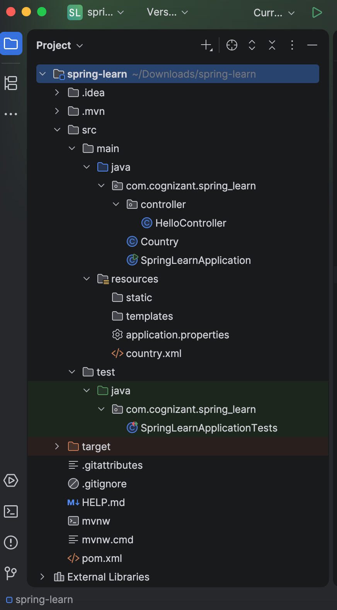
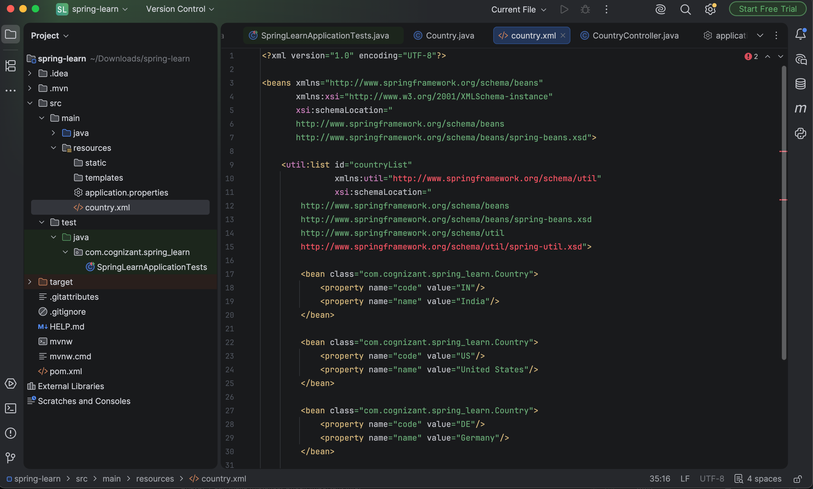
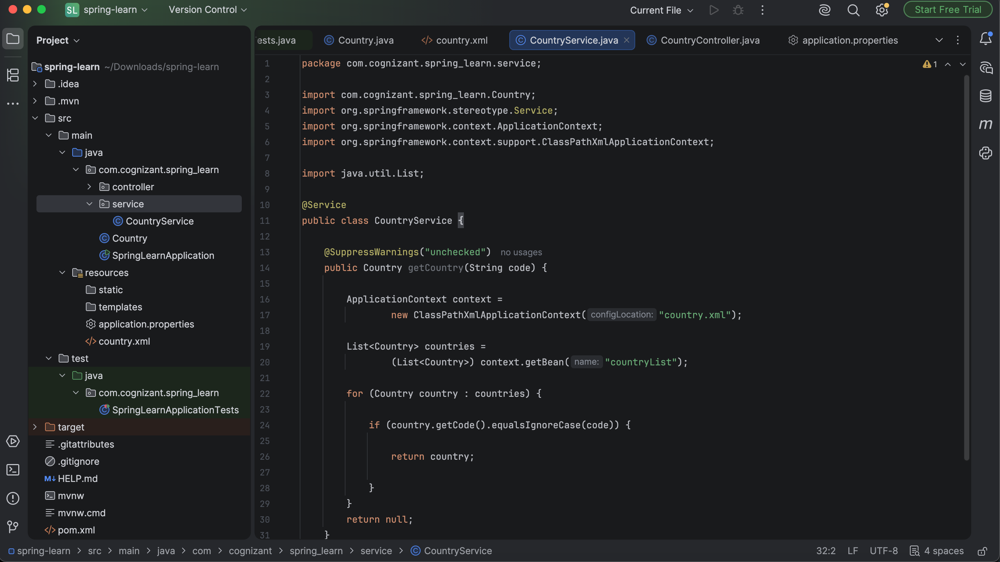
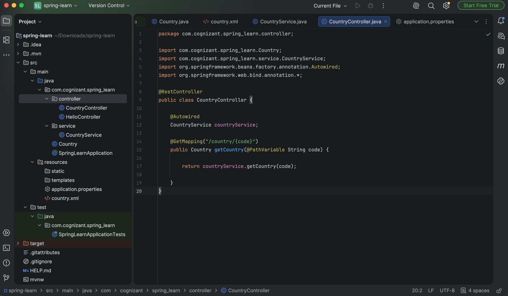
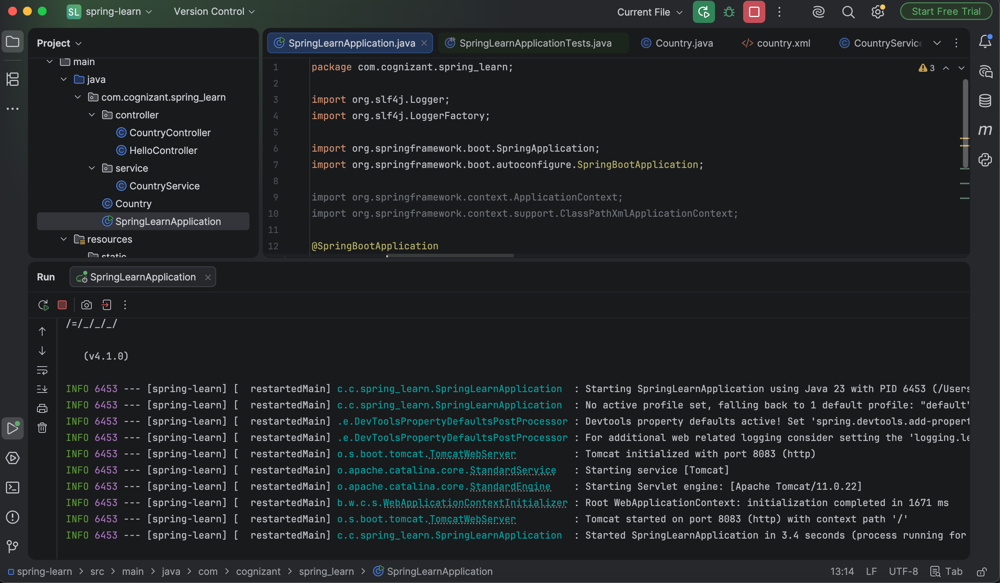
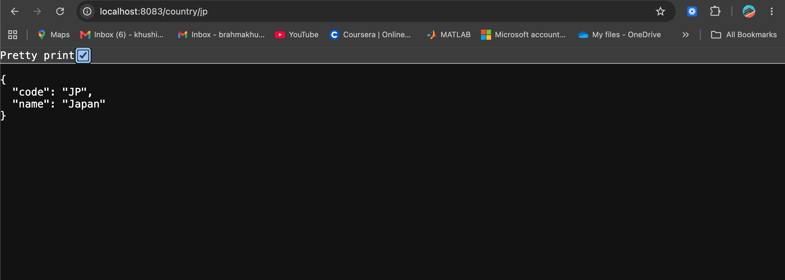
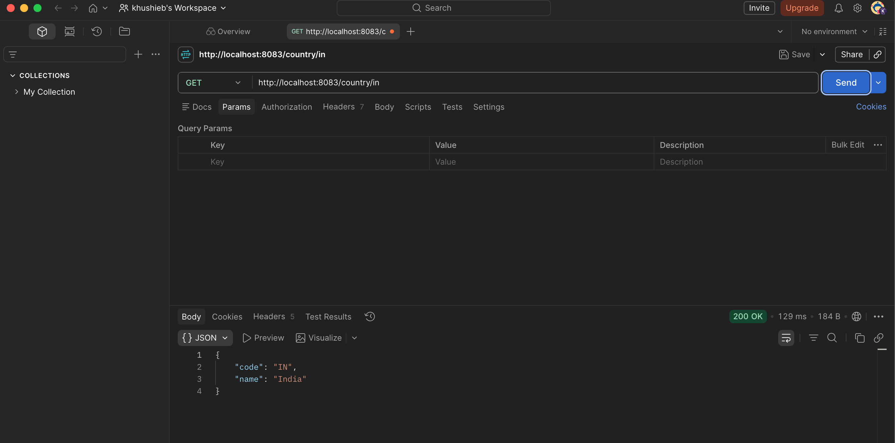
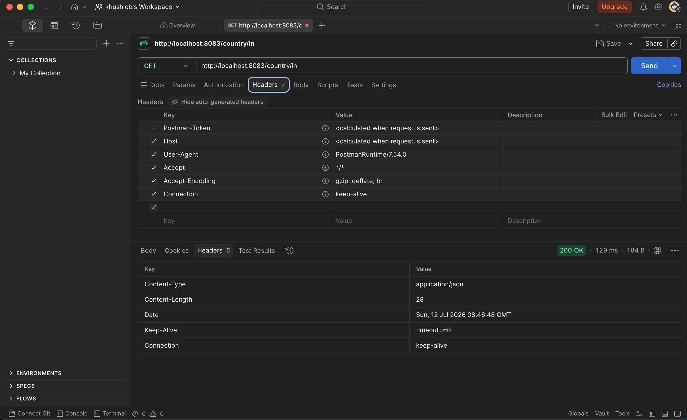

# REST – Get Country Based on Country Code

## Objective
Develop a RESTful web service using Spring Boot that returns the details of a country based on the country code provided in the URL. The lookup should be case-insensitive.

---

## Project Structure
```
REST-Get-country-based-on-country-code/
│
├── pom.xml
├── README.md
├── src
│   ├── main
│   │   ├── java
│   │   │   └── com
│   │   │       └── cognizant
│   │   │           └── spring_learn
│   │   │               ├── Country.java
│   │   │               ├── SpringLearnApplication.java
│   │   │               ├── controller
│   │   │               │   ├── HelloController.java
│   │   │               │   └── CountryController.java
│   │   │               └── service
│   │   │                   └── CountryService.java
│   │   └── resources
│   │       ├── application.properties
│   │       └── country.xml
│   └── test
│       └── java
│           └── com
│               └── cognizant
│                   └── spring_learn
│                       └── SpringLearnApplicationTests.java
│
└── images
    ├── project_structure.png
    ├── country_xml.png
    ├── country_service.png
    ├── country_controller.png
    ├── application_running.png
    ├── browser_output.png
    ├── postman_output.png
    └── postman_headers.png
```

---

# Technologies Used
- Java 17
- Spring Boot
- Spring Web
- Spring Core (XML Configuration)
- Maven
- REST API
- Postman

---

# Implementation Steps

### 1. Open Existing Spring Boot Project
Used the previously created **spring-learn** project as the base application.
### Screenshot


---

### 2. Configure Country List in XML
Updated `country.xml` to define multiple country beans using Spring XML configuration.
### Screenshot


---

### 3. Create Service Layer
Created `CountryService.java` to:
- Load country data from `country.xml`
- Read all configured countries
- Perform a case-insensitive search
- Return the matching Country object
### Screenshot


---

### 4. Create REST Controller
Implemented `CountryController.java`.
Endpoint:
```
GET /country/{code}
```

The controller accepts the country code using `@PathVariable` and calls the service layer.
### Screenshot


---

### 5. Build and Run Application
Compiled the application successfully using Maven.
```bash
./mvnw clean install
```

Started the Spring Boot application.
### Screenshot


---

### 6. Test REST API in Browser
Opened:
```
http://localhost:8083/country/in
```
Successfully received the JSON response.
### Screenshot


---

### 7. Test REST API in Postman
Performed a GET request.
```
GET http://localhost:8083/country/in
```

Received the JSON response successfully.
### Screenshot


---

### 8. Verify HTTP Headers
Verified the response headers returned by the REST API in Postman.
### Screenshot


---

# Sample Request
```
GET http://localhost:8083/country/in
```

---

# Sample Response
```json
{
    "code": "IN",
    "name": "India"
}
```

---

# Features
- RESTful API using Spring Boot
- Uses `@PathVariable`
- Service layer implementation
- Reads country data from Spring XML configuration
- Case-insensitive country code search
- Returns JSON response automatically
- Tested using Browser and Postman

---

# Result
Successfully implemented a RESTful web service that retrieves country details based on a case-insensitive country code provided in the URL. The application was built successfully, executed without errors, and verified using both a web browser and Postman.
