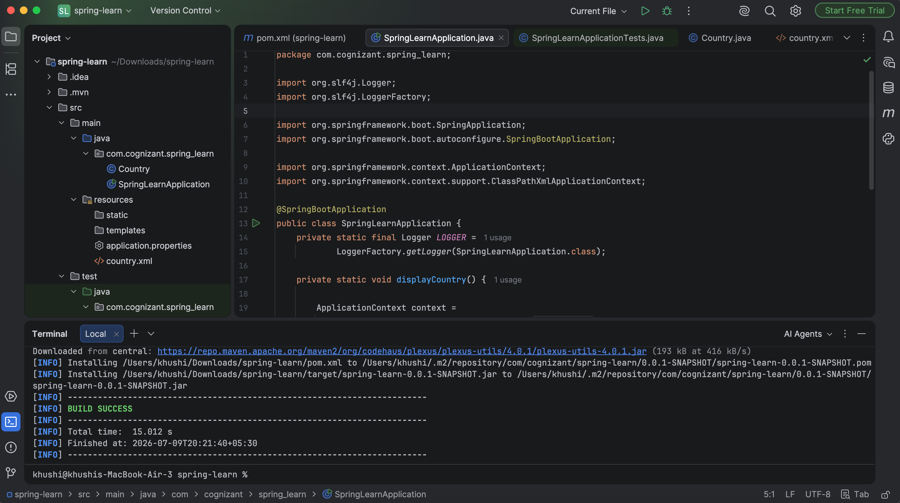

# Spring Core – Load Country from Spring Configuration XML

## Objective
This hands-on demonstrates how to load a Spring Bean from an XML configuration file using the Spring IoC Container.
The application reads a `Country` bean from `country.xml` and displays the configured country details.

---

## Technologies Used
- Java 17
- Spring Boot 3
- Spring Core
- Maven
- IntelliJ IDEA

---

## Project Structure
```
├── pom.xml
├── README.md
├── src
│   ├── main
│   │   ├── java
│   │   │   └── com.cognizant.spring_learn
│   │   │       ├── Country.java
│   │   │       └── SpringLearnApplication.java
│   │   │
│   │   └── resources
│   │       ├── application.properties
│   │       └── country.xml
│   │
│   └── test
│
└── images
```

---

### Screenshot
Built the project using Maven.
```bash
./mvnw clean install
```



---

## Concepts Covered
- Spring Core
- Spring IoC Container
- Bean Configuration using XML
- ApplicationContext
- ClassPathXmlApplicationContext
- Dependency Injection
- Maven Build
- SLF4J Logging

---

## Conclusion
This hands-on successfully demonstrates loading a Spring Bean from an XML configuration file using the Spring IoC Container and retrieving the configured object within a Spring Boot application.
